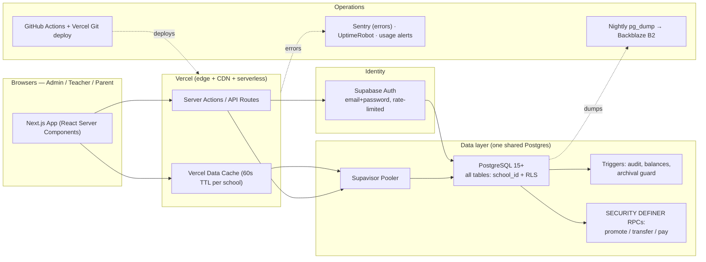
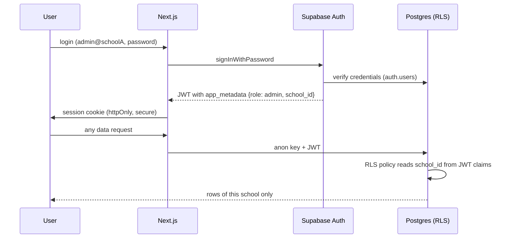

# School Management SaaS — Cost-Optimized System Architecture

> Analyzed from `PRD.md` · Date: Aug 2026 · Pricing verified against Supabase & Vercel published pricing (July–Aug 2026 — re-verify before purchase)

---

## Table of Contents

1. [Executive Summary](#1-executive-summary)
2. [PRD Review — Issues & Corrections](#2-prd-review--issues--corrections)
3. [Target Architecture](#3-target-architecture)
4. [Recommended Stack & Cost Tiers](#4-recommended-stack--cost-tiers)
5. [Authentication, Authorization & RLS (The Big Fix)](#5-authentication-authorization--rls-the-big-fix)
6. [Corrected Database Design](#6-corrected-database-design)
7. [Application Design Patterns](#7-application-design-patterns)
8. [Performance & Concurrency (1,000 Users)](#8-performance--concurrency-1000-users)
9. [Security Hardening](#9-security-hardening)
10. [Cost Optimization Playbook](#10-cost-optimization-playbook)
11. [Operations: CI/CD, Backups, Monitoring, DR](#11-operations-cicd-backups-monitoring-dr)
12. [Implementation Roadmap (mapped to PRD phases)](#12-implementation-roadmap-mapped-to-prd-phases)
13. [Open Questions for the Product Owner](#13-open-questions-for-the-product-owner)

---

## 1. Executive Summary

The PRD describes a solid product: a multi-tenant school management SaaS (Admin / Teacher / Parent portals) covering sessions, classes, students, teachers, fees, attendance, marks, diary, timetable, and a year-end promote/demote/repeat workflow — all in **one shared PostgreSQL database with `school_id` + Row-Level Security**. That base decision (single shared DB, no subdomain, manual payments, no image uploads) is already the right one for cost and simplicity. **Keep it.**

However, the PRD has **one critical security flaw, several data-integrity gaps, and no cost/ops plan**. This document fixes all of them. Highlights:

| # | Finding | Severity | Fix (detailed in this doc) |
|---|---------|----------|---------------------------|
| 1 | **NextAuth v5 + Supabase RLS don't work together** — NextAuth's JWT is not a Supabase JWT, so RLS has no identity to enforce against | 🔴 Critical | Use **Supabase Auth** as the single identity source; RLS reads `auth.jwt()` claims |
| 2 | `parent_password_hash` stored on `students` table — second, inconsistent password store | 🔴 Critical | Unified `users` table + `parent_users` link table |
| 3 | `students.current_class_id` — transfer/promotion history is lost | 🟠 High | New `enrollments` table (full history, one class per student per session enforced by DB) |
| 4 | Fee voucher "one per class per month" rule not enforceable (no `class_id` on voucher) | 🟠 High | Add `class_id` + partial unique index |
| 5 | `paid_amount`/status managed in app code → race conditions, duplicate payments | 🟠 High | DB trigger recomputes from `fee_payments`; status as generated column |
| 6 | Attendance duplicates possible (no unique constraint) | 🟠 High | `UNIQUE (student_id, session_id, date)` |
| 7 | Audit logging only at app level → bypassable | 🟠 High | DB triggers write `audit_logs` (tamper-resistant) |
| 8 | Promotion/demotion = multiple app-level writes → partial failure can lose a student | 🟠 High | Single `SECURITY DEFINER` RPC in one transaction with fee check inside |
| 9 | Archived session "read-only" is app-level only | 🟠 High | DB trigger rejects writes to archived sessions |
| 10 | No rate limiting / brute-force protection on credentials login | 🟠 High | Supabase Auth built-in limits + app-level rate limiting |
| 11 | **No backup/DR plan at all** (Supabase Free has NO backups) | 🔴 Critical | Daily `pg_dump` to B2/S3, retention policy, restore drill |
| 12 | No env separation, CI/CD, or monitoring mentioned | 🟡 Medium | 3 environments, GitHub Actions, migrations in repo, Sentry/UptimeRobot |
| 13 | Cost leaks: Realtime subscriptions, polling storms, per-row RLS subqueries | 🟡 Medium | Polling + caching strategy, JWT-claim RLS, egress budget |
| 14 | "1,000+ concurrent users" goal needs a design, not a hope | 🟡 Medium | Dashboard aggregates, pagination, data-cache TTL — capacity math included |
| 15 | Vercel **Hobby is non-commercial** (ToS) — you cannot legally run a paid SaaS on it | 🟡 Medium | Start Pro ($20/mo) or Cloudflare Pages (commercial OK, $0) |

**Cost answer in one line:** this system can run at **$20–45/month for the first ~100 schools**, and a **$10/month VPS route** exists for later. The expensive traps (Realtime, per-user projects, over-pagination, image uploads, Redis, multi-region) are all avoidable and are explicitly avoided here.

---

## 2. PRD Review — Issues & Corrections

### 2.1 Critical: NextAuth v5 (Credentials) + Supabase RLS is a security mismatch

**The problem.** Supabase RLS works by reading Supabase's own JWT (`auth.jwt()`) or user id (`auth.uid()`). NextAuth v5 signs its **own** JWT with your own secret. So when your Next.js server calls Supabase with the NextAuth session, Supabase sees **no authenticated identity** — RLS cannot tell which school the request belongs to. Teams respond to this in one of two bad ways:

- They disable RLS and rely on app-code checks → **any leaked anon/service key or any forgotten check = cross-school data leak** (the exact thing this product must never have).
- They bolt on hacks (passing NextAuth tokens into `Authorization` headers) that Supabase rejects.

**The fix (recommended):** Drop NextAuth. Use **Supabase Auth** (email+password) as the single identity source. It's free (50k MAU), built on Postgres, has built-in rate limiting, and makes RLS trivial:

- Sign-in identifier = the PRD's login id (`admin@schoolA`) stored as the auth email. It already contains the school slug, so global uniqueness is structurally guaranteed (two schools can't collide).
- `app_metadata` of each user carries `{ role, school_id }` → **every JWT automatically contains them** → RLS policies read them from the token. No DB lookup per query, fast, and impossible to spoof.

**Alternative (only if you insist on keeping NextAuth):** keep NextAuth for sessions, but then all DB access must go through server code with `school_id` taken from the NextAuth session, and RLS becomes defense-in-depth using a per-request session variable (`SET LOCAL app.school_id = …` via a direct `pg` connection). This loses Supabase's client-side magic (no direct browser→DB queries) and adds plumbing. **Not recommended** — one identity source is strictly simpler and safer.

> Note: verify that Supabase Auth accepts single-label domains like `schoolA` in email format. If validation rejects it, append a suffix domain (`admin@schoolA.lan` or similar) and normalize to lowercase at sign-up. Test in Phase 1.

### 2.2 Critical: No backups (Supabase Free tier has none)

The PRD has no backup plan. Supabase **Free has no backups and no PITR**; Pro adds daily backups (7-day retention) and optional PITR. Fix: nightly `pg_dump` from day one (cron or GitHub Action) to Backblaze B2 (~$1/month), 30-day retention + monthly cold copy. Documented restore runbook, quarterly restore drill. (See §11.)

### 2.3 High: Data model corrections

| PRD as written | Problem | Correction |
|---|---|---|
| `students.parent_password_hash` | Two password stores; inconsistent with `users` table | Remove. One `users` row per person (role `admin/teacher/parent`); `parent_users(user_id, student_id)` links a parent login to a child |
| `students.current_class_id` | Transfer/promotion history destroyed; can't reconstruct "which class in 2024-25?" | `enrollments(student_id, session_id, class_id, status, joined_on, left_on)` with `UNIQUE(student_id, session_id)`. "Current class" = latest active enrollment |
| `fee_vouchers` has no `class_id` | "One batch voucher per class per month" cannot be enforced by the DB | Add `class_id`, partial unique index on `(school_id, class_id, session_id, month_year) WHERE type='batch'` |
| `paid_amount` + `status` updated in app | Double-click / concurrent recording corrupts balances | Insert into `fee_payments`; a trigger recomputes `paid_amount`; `status` is a **generated column** (unpaid/partial/paid) — cannot drift |
| `attendance` no uniqueness | Same student marked twice on same date | `UNIQUE (student_id, session_id, date)` |
| `subjects` without session | "Per class per session" is indirect via class | Add explicit `session_id` (keeps PRD's per-class-subject philosophy; no global pool) |
| `timetable_entries` no conflict rules | Teacher double-booked; class double-booked | `UNIQUE (class_id, day_of_week, start_time)` + app-level teacher conflict check (or `EXCLUDE USING gist` with `btree_gist`) |
| `marks_records` no uniqueness | Same student twice in one entry | `UNIQUE (marks_entry_id, student_id)` |
| `fee_payments` no payment method | Schools must record cash/cheque/bank | Add `payment_method` + optional `reference_no` |
| `audit_logs` generic | Hard to report on | Structured `action` (`fee.voucher.edit`, `marks.update`, `student.promote`…), JSONB diffs, `actor_user_id` |

### 2.4 High: Business rules must be enforced at the DB, not just the UI

| Rule from PRD | DB-level enforcement |
|---|---|
| One batch voucher per class per month | Partial unique index (§2.3) |
| Attendance by class incharge only | RLS policy checks the teacher is the class incharge (§5.3) |
| Parents see only own child | RLS policy via `parent_users` (§5.3) |
| No data leakage between schools | `school_id` JWT claim on every policy (start of every policy) |
| Promotion requires fees cleared | Checked **inside** the promotion transaction (`SELECT … FOR UPDATE` on vouchers) — not checked-then-act (TOCTOU bug in PRD flow) |
| Archived session read-only | Trigger raises exception on any write to rows referencing an archived session |
| Marks edits logged | `AFTER UPDATE` trigger on `marks_records` |
| No duplicate attendance | Unique constraint |

### 2.5 Medium: Cost & scale corrections

- **Realtime**: the PRD lists "Real-time / Cache: TanStack Query". Do **not** use Supabase Realtime — it's a billed dimension (2M messages free, then per-message), adds connection complexity, and a school app does not need sub-second push. Use TanStack Query polling with smart intervals (2–5 min for dashboards, refetch on window focus and after mutations). Cheaper, simpler, testable.
- **Egress budget**: Supabase Free gives 5 GB egress. A parent polled every 60 s × 12 h/day ≈ 21,600 requests × ~5 KB ≈ **108 MB/month per active parent** → 5 GB ≈ **~45 heavy parents**. So: poll ≥ 2–5 min, cache server-side (Vercel data cache, 60 s TTL keyed by school), and let the client cache with `staleTime`. This keeps a school of 2,000 parents under 5 GB comfortably.
- **"1,000+ concurrent users"**: that's an evening burst (parents 7–9 PM), not sustained load. 1,000 concurrent ≈ 50–100 req/s of small JSON reads — one Postgres with good indexes and a pooler handles this trivially. The design target is **no N+1 queries and no per-student loops**, not distributed systems. (Capacity math in §8.)
- **Free-tier headroom math**: 500 MB DB ≈ **10–15k students** (dominated by attendance rows, ~70 bytes/row). 50k MAU is never a constraint for schools. So Supabase Free comfortably covers launch; **upgrade to Pro when DB > 400 MB or egress > 4 GB/month** — set calendar reminders, don't rely on memory.
- **Vercel Hobby is non-commercial by ToS.** For a paid SaaS, use **Pro ($20/seat)** — or **Cloudflare Pages (free, commercial use allowed, OpenNext adapter)** if you want a legit $0 frontend host. A VPS (next section) is the third option.
- **No image/file uploads in the PRD** — keep it that way. Files are the #1 egress/storage cost. If report cards/photos arrive later, use Cloudflare R2 ($0 egress, ~$0.015/GB) or Supabase Storage (1 GB free / 100 GB Pro).

---

## 3. Target Architecture



**Flow rules (design invariants):**

1. **All data reads/writes go through RLS-protected Postgres.** The browser uses only the anon key (safe by design — RLS does the authorization). The `service_role` key exists **only** in server env vars (admin password resets, invite tokens) and is never in the client bundle.
2. **Writes that span multiple rows happen in DB transactions** via RPC functions (promotion, transfer, fee payment) — never as a chain of app-level calls.
3. **Expensive aggregations are cached** (Vercel data cache, 60 s TTL, keyed by school) so the evening parent burst hits the cache, not the DB.
4. **No Realtime, no Redis, no object storage, no worker queues** until a concrete need exists.

---

## 4. Recommended Stack & Cost Tiers

### 4.1 Stack (default, recommended)

| Layer | Choice | Why |
|---|---|---|
| Frontend | Next.js 14 App Router + Tailwind (as in PRD) | Best server-component DX; RSC moves DB queries server-side |
| Backend | Server Actions for mutations, RPC calls for multi-step DB ops | Fewer moving parts than API routes |
| Identity | **Supabase Auth** (replaces NextAuth) | Free 50k MAU, rate-limited, RLS-native |
| Database | **Supabase Postgres** (single project, shared multi-tenant) | PRD's choice is right; one DB is the cheapest correct answer |
| Client data | TanStack Query (polling, not Realtime) | No per-message cost, simpler |
| Hosting | Vercel Pro (or Cloudflare Pages for $0 commercial) | See tiers below |
| Cache | Vercel data cache (`unstable_cache`, 60 s TTL per school) | Cuts DB load + egress during bursts |
| Cron | Vercel Cron (fee reminders, session archival checks) | Free within plan |
| Backups | Nightly `pg_dump` → Backblaze B2 | B2: $6/TB, **free egress** |
| Errors | Sentry free tier (5k events/mo) | Cheap insurance |
| Uptime | UptimeRobot free | Alerts when school users are down |
| CI/CD | GitHub Actions + Vercel Git integration | $0, standard |

### 4.2 Cost tiers (verified pricing, July 2026)

| | **Tier 0 — Dev/Pilot** | **Tier 1 — Launch (recommended)** | **Tier 2 — Growth** | **Tier 3 — Cost-min hybrid** | **Tier 4 — Full DIY** |
|---|---|---|---|---|---|
| Frontend host | Vercel Hobby $0 (non-commercial — pilots OK, not paying schools) | Vercel Pro **$20** | Vercel Pro $20 | Cloudflare Pages $0 (commercial OK) | Hetzner VPS (Next.js standalone) |
| Database | Supabase Free $0 | Supabase Free $0 → Pro $25 when >400 MB DB or >4 GB egress | Supabase Pro **$25** | Hetzner CX22 Postgres **~$5** | Same VPS Postgres |
| Backups | Manual pg_dump to B2 (~$1) | Nightly pg_dump to B2 ~$1–2 | Supabase daily (Pro) + B2 archival ~$2 | pgBackRest → B2 ~$2 | pgBackRest → B2 ~$2 |
| **Monthly total** | **$0–1** | **$20 → $45** | **~$47** | **~$8–10** | **~$10–12** |
| Capacity | Dev/staging + pilots | ~10–15k students (~20–40 schools) | ~50–80k students (100–200 schools) | ~50k+ students, DB nearly unlimited | 1,000+ concurrent easily; DB nearly unlimited |
| Ops burden | None | None | None | Low (backup script + updates) | Medium (security patches, monitoring, runbook) |

**Recommended path:** Tier 1 → Tier 2 as schools grow, and keep Tier 3 in your back pocket for when the SaaS has 100+ schools (that's when managed costs start exceeding ~$50/mo and the hybrid becomes the clear winner). Tier 4 is for a single founder comfortable with Linux; it's the absolute cheapest but you own patching, security, and restores.

**Unit economics sanity check:** at $45/mo infra and charging schools $3–5/month, the first **10–15 paying schools cover infrastructure**. Everything above that is margin. If you plan $2/school, ~25 schools cover infra.

> All prices are indicative snapshots (July–Aug 2026). Re-verify at vercel.com/pricing and supabase.com/pricing before committing. The architecture does not depend on any specific vendor's price: the same design runs on Supabase, Neon, or your own Postgres.

### 4.3 What you should explicitly NOT buy (until needed)

- ❌ Supabase **Realtime** subscriptions (billed per message; polling is free)
- ❌ A database **per school** (the PRD's single-DB choice is correct — keep it)
- ❌ **Redis/Upstash** (Vercel data cache + TanStack Query is enough)
- ❌ **Read replicas** (one Postgres handles 100× this workload; revisit only for heavy year-end reporting)
- ❌ **Multi-region** (pick one region near your schools; e.g., `ap-south-1` / `ap-southeast-1` for South Asia, or `us-east-1` for US)
- ❌ **Object storage / image pipeline** (no uploads in PRD; defer)
- ❌ **PDF generation libraries** on the server (print receipts/report cards with browser print CSS — free; CSV/Excel export client-side)
- ❌ **Separate mail service** (no emails in scope — no forgot-password; admin resets in-app)

---

## 5. Authentication, Authorization & RLS (The Big Fix)

### 5.1 Identity model



- **One `users` row per person** (`id = auth.users.id`, `school_id`, `role`, `login_id`, `is_active`). Teachers/students reference `users.id`.
- **Role + school_id stored in `app_metadata`** → automatically embedded in every JWT. RLS policies read them directly — no subquery, no per-query DB lookup.
- **Login id = email in Supabase Auth.** `admin@schoolA` already encodes the school slug, so ids are globally unique across the whole SaaS (the PRD's no-subdomain design works perfectly).

### 5.2 Session & password rules (per PRD: no forgot-password)

- Access token expiry 1 h, refresh token rotation on (Supabase defaults).
- Session cookie: `httpOnly`, `secure`, `sameSite=lax`; middleware refreshes before expiry.
- No public "forgot password" — **admin-initiated reset** only: admin triggers RPC → server (with `service_role` server-side) sets a temporary password → prints/shows it to the admin to hand over (school context, not email — matches PRD and the no-email constraint).
- Password policy enforced at admin/teacher creation: min 8 chars, mixed case + digit (client and server side).
- First admin per school: **invite token** (72 h expiry, single use) issued by the SaaS owner — never a default password.
- Logins are **audited** (user, login id, timestamp, IP) into `audit_logs`.

### 5.3 RLS policy pattern (apply to every table)

```sql
-- Every table: ENABLE ROW LEVEL SECURITY
ALTER TABLE attendance ENABLE ROW LEVEL SECURITY;

-- 1) School isolation: the FIRST clause of every policy.
--    Reads school_id from the JWT claim — no subquery, fast, unspoofable.
CREATE POLICY "school_scope" ON attendance
  FOR ALL
  USING (school_id = ((auth.jwt() -> 'app_metadata' ->> 'school_id'))::uuid);

-- 2) Teacher role: only the class incharge touches attendance.
CREATE POLICY "incharge_only" ON attendance
  FOR ALL
  USING (class_id IN (
    SELECT c.id FROM classes c
    WHERE c.class_incharge_teacher_id =
          (SELECT id FROM teachers WHERE user_id = auth.uid())
  ));

-- 3) Parent role: read only their own child's rows.
CREATE POLICY "parent_own_child" ON attendance
  FOR SELECT
  USING (student_id IN (
    SELECT student_id FROM parent_users WHERE user_id = auth.uid()
  ));

-- Admin role: school_scope alone is enough (admins see all of their school).
```

Policy inventory (every table gets these three families where applicable):

| Table | Admin | Teacher | Parent |
|---|---|---|---|
| sessions, classes, subjects, timetable_entries, students | full (school) | read own school | none (except own class timetable) |
| enrollments | full (school) | read own classes | read own child |
| attendance | full (school) | incharge class only (write+read) | own child (read) |
| marks_entries / marks_records | full (school) | their subject assignments (write/read) | own child (read) |
| diary_entries | full (school) | their subject assignments (write/read) | own child's class (read) |
| fee_vouchers / fee_payments | full (school) | none | own child (read) |
| audit_logs | full (school) | none | none |
| users / parent_users | full (school) | read own row | read own row |

> **Never** `ALTER TABLE … DISABLE ROW LEVEL SECURITY` to "fix" a slow query — fix the query. A leaked key must be survivable; RLS is that guarantee.

---

## 6. Corrected Database Design

### 6.1 Schema overview

```
schools ──┬── sessions ──┬── classes ──┬── subjects (per class per session)
          │              │             ├── timetable_entries
          │              │             ├── enrollments ── students
          │              │             └── teacher_assignments ── teachers
          │              │             └── classes.class_incharge_teacher_id
          │              │
          │              ├── fee_vouchers ── fee_payments
          │              ├── marks_entries ── marks_records
          │              ├── diary_entries
          │              └── attendance
          │
          ├── users (admin/teacher/parent; id = auth.users.id)
          ├── parent_users (user_id ↔ student_id)
          └── audit_logs (trigger-written)
```

Every table: `school_id`, `created_at`, `updated_at` (trigger-maintained), FK to school.

### 6.2 Key DDL (critical parts — illustrative, adapt to your naming)

**Enrollments — history, one class per student per session:**
```sql
CREATE TABLE enrollments (
  id         bigint GENERATED ALWAYS AS IDENTITY PRIMARY KEY,
  school_id  uuid        NOT NULL REFERENCES schools(id),
  student_id bigint      NOT NULL REFERENCES students(id),
  session_id bigint      NOT NULL REFERENCES sessions(id),
  class_id   bigint      NOT NULL REFERENCES classes(id),
  status     text        NOT NULL DEFAULT 'active'
               CHECK (status IN ('active','left','transferred',
                                 'promoted','demoted','repeated')),
  joined_on  date        NOT NULL DEFAULT CURRENT_DATE,
  left_on    date,
  UNIQUE (student_id, session_id)          -- one class per student per session
);
-- "current class" = the 'active' enrollment of the current session
```

**Attendance — no duplicates:**
```sql
CREATE TABLE attendance (
  id                   bigint GENERATED ALWAYS AS IDENTITY PRIMARY KEY,
  school_id            uuid   NOT NULL,
  session_id           bigint NOT NULL,
  class_id             bigint NOT NULL,
  student_id           bigint NOT NULL,
  date                 date   NOT NULL,
  status               text   NOT NULL CHECK (status IN ('present','absent','late')),
  marked_by_teacher_id bigint NOT NULL,
  UNIQUE (student_id, session_id, date)
);
CREATE INDEX idx_attendance_class_date ON attendance (school_id, class_id, date);
```

**Fee vouchers — rule enforced by the database:**
```sql
CREATE TABLE fee_vouchers (
  id           bigint GENERATED ALWAYS AS IDENTITY PRIMARY KEY,
  school_id    uuid           NOT NULL,
  student_id   bigint         NOT NULL,
  class_id     bigint         NOT NULL,          -- ADDED (needed for the batch rule)
  session_id   bigint         NOT NULL,
  type         text           NOT NULL CHECK (type IN ('batch','fine')),
  month_year   date           NOT NULL,          -- first day of the month
  total_amount numeric(12,2)  NOT NULL CHECK (total_amount >= 0),
  paid_amount  numeric(12,2)  NOT NULL DEFAULT 0,
  status       text GENERATED ALWAYS AS (        -- derived, cannot drift
                 CASE WHEN paid_amount <= 0 THEN 'unpaid'
                      WHEN paid_amount < total_amount THEN 'partial'
                      ELSE 'paid' END) STORED,
  issued_by    uuid           NOT NULL,
  created_at   timestamptz    NOT NULL DEFAULT now(),
  updated_at   timestamptz    NOT NULL DEFAULT now()
);

-- THE business rule, at the DB level:
CREATE UNIQUE INDEX uq_batch_voucher_class_month
  ON fee_vouchers (school_id, class_id, session_id, month_year)
  WHERE type = 'batch';

-- Payments → balance, atomically (insert payment, trigger updates voucher):
CREATE TABLE fee_payments (
  id             bigint GENERATED ALWAYS AS IDENTITY PRIMARY KEY,
  school_id      uuid           NOT NULL,
  voucher_id     bigint         NOT NULL REFERENCES fee_vouchers(id),
  amount_paid    numeric(12,2)  NOT NULL CHECK (amount_paid > 0),
  payment_date   date           NOT NULL DEFAULT CURRENT_DATE,
  payment_method text           NOT NULL CHECK (payment_method IN ('cash','cheque','bank','other')),
  reference_no   text,
  recorded_by    uuid           NOT NULL
);

CREATE OR REPLACE FUNCTION fn_recompute_voucher_balance() RETURNS trigger AS $$
DECLARE v_paid numeric(12,2);
BEGIN
  SELECT COALESCE(SUM(amount_paid), 0) INTO v_paid
    FROM fee_payments WHERE voucher_id = COALESCE(NEW.voucher_id, OLD.voucher_id);
  UPDATE fee_vouchers SET paid_amount = v_paid
   WHERE id = COALESCE(NEW.voucher_id, OLD.voucher_id);
  RETURN NULL;
END $$ LANGUAGE plpgsql;

CREATE TRIGGER trg_balance AFTER INSERT OR UPDATE OR DELETE ON fee_payments
  FOR EACH ROW EXECUTE FUNCTION fn_recompute_voucher_balance();
```

**Audit — guaranteed by triggers (app code cannot skip it):**
```sql
CREATE TABLE audit_logs (
  id           bigint GENERATED ALWAYS AS IDENTITY PRIMARY KEY,
  school_id    uuid   NOT NULL,
  action       text   NOT NULL,          -- e.g. 'marks.update', 'student.promote'
  actor_user_id uuid,
  target_type  text   NOT NULL,
  target_id    bigint,
  old_values   jsonb,
  new_values   jsonb,
  occurred_at  timestamptz NOT NULL DEFAULT now()
);
CREATE INDEX idx_audit_school_time ON audit_logs (school_id, occurred_at DESC);

CREATE OR REPLACE FUNCTION fn_audit_marks() RETURNS trigger AS $$
BEGIN
  INSERT INTO audit_logs (school_id, action, actor_user_id, target_type, target_id, old_values, new_values)
  VALUES (NEW.school_id, 'marks.' || lower(TG_OP), auth.uid(), 'marks_records',
          COALESCE(OLD.id, NEW.id),
          CASE WHEN TG_OP = 'INSERT' THEN NULL ELSE to_jsonb(OLD) END,
          to_jsonb(NEW));
  RETURN COALESCE(NEW, OLD);
END $$ LANGUAGE plpgsql SECURITY DEFINER;

CREATE TRIGGER trg_audit_marks AFTER INSERT OR UPDATE OR DELETE ON marks_records
  FOR EACH ROW EXECUTE FUNCTION fn_audit_marks();
-- Same pattern: fee_vouchers, fee_payments, attendance, enrollments, students(status changes)
```

**Archived-session write guard:**
```sql
CREATE OR REPLACE FUNCTION fn_block_archived_writes() RETURNS trigger AS $$
BEGIN
  IF EXISTS (SELECT 1 FROM sessions
             WHERE id = COALESCE(NEW.session_id, OLD.session_id)
               AND status = 'archived') THEN
    RAISE EXCEPTION 'Session is archived — data is read-only';
  END IF;
  RETURN COALESCE(NEW, OLD);
END $$ LANGUAGE plpgsql;
-- Attach BEFORE INSERT/UPDATE/DELETE on: attendance, marks_records,
-- diary_entries, fee_vouchers, fee_payments, enrollments, timetable_entries
```

**Promotion (multi-step → one transaction):**
```sql
CREATE OR REPLACE FUNCTION promote_student(
  p_student_id  bigint,
  p_new_class_id bigint,
  p_new_session_id bigint
) RETURNS void LANGUAGE plpgsql SECURITY DEFINER AS $$
DECLARE
  v_school  uuid;
  v_cur_session bigint;
  v_unpaid  bigint;
BEGIN
  SELECT school_id INTO v_school FROM students WHERE id = p_student_id;
  IF v_school IS DISTINCT FROM ((auth.jwt() -> 'app_metadata' ->> 'school_id'))::uuid
     OR auth.jwt() -> 'app_metadata' ->> 'role' <> 'admin' THEN
    RAISE EXCEPTION 'Access denied';
  END IF;

  -- fee check INSIDE the transaction (locks vouchers -> no race with payments)
  SELECT session_id INTO v_cur_session FROM enrollments
   WHERE student_id = p_student_id AND status = 'active';
  SELECT count(*) INTO v_unpaid FROM fee_vouchers
   WHERE student_id = p_student_id AND session_id = v_cur_session
     AND paid_amount < total_amount
   FOR UPDATE;
  IF v_unpaid > 0 THEN RAISE EXCEPTION 'Fees outstanding — promotion blocked'; END IF;

  -- move the student, archive old class if empty, audit — all atomic here
  UPDATE enrollments SET status = 'promoted', left_on = CURRENT_DATE
   WHERE student_id = p_student_id AND status = 'active';
  INSERT INTO enrollments (school_id, student_id, session_id, class_id)
   VALUES (v_school, p_student_id, p_new_session_id, p_new_class_id);
  PERFORM fn_archive_empty_class(...);  -- your class-archival logic
  INSERT INTO audit_logs (...) VALUES (v_school, 'student.promote', ...);
END $$;
-- Same pattern: demote_student(), repeat_student(), transfer_student(), record_payment()
```

### 6.3 Index checklist

- Every FK column → composite index starting with `school_id` (so every query is school-scoped from the index: `(school_id, class_id, date)`, `(school_id, session_id, month_year)`, …).
- `attendance (school_id, class_id, date)`; `fee_vouchers (school_id, student_id, session_id)`; `audit_logs (school_id, occurred_at DESC)`.
- `marks_records (marks_entry_id, student_id)` (also enforces uniqueness).
- Partial unique index for the batch-voucher rule (§6.2).
- Test with `EXPLAIN ANALYZE` on the heaviest queries (dashboard, attendance list, fee ledger) in Phase 6.

---

## 7. Application Design Patterns

### 7.1 Next.js structure

```
app/
  (auth)/login/                  # sign in page
  (portal)/
    admin/...                    # admin pages (server components)
    teacher/...
    parent/...
    _actions/                    # server actions (mutations)
  api/trpc-less/...              # (only if server actions can't express it)
lib/
  supabase/server.ts             # server client (anon key + request JWT)
  supabase/client.ts             # browser client (anon key only)
  rpc/                           # typed wrappers around promote/transfer/pay RPCs
db/migrations/                   # SQL migrations in repo (supabase/migrations)
```

- **Pages = React Server Components** that query the DB directly through the RLS'd server client. No client fetch waterfalls, fewer function invocations, faster.
- **Mutations = Server Actions**; multi-row mutations call the RPC functions (§6.2). Server actions get their own `school_id` check (defense in depth) plus RLS.
- **`school_id` never travels in URLs** (no `?school=…`). It comes from the JWT claim server-side. Paths are role-based (`/admin`, `/teacher`, `/parent`) and the middleware redirects by role claim.

### 7.2 Data fetching & caching (the cost lever)

| Data | Client caching (`staleTime`) | Server data cache (TTL) | Refetch |
|---|---|---|---|
| Timetable, subjects, class lists | 5 min | 5 min | on mutation |
| Dashboard stats | 60 s | 60 s | on mutation + poll 60 s |
| Diary feed | 30 s | none | poll 60 s + focus |
| Marks grids | 30 s | none | on mutation |
| Fee ledger | 30 s | none | on mutation |
| Audit logs | 0 | none | manual refresh (pagination) |

- TanStack Query: `refetchOnWindowFocus`, `refetchOnMount` only for mutable data; everything else `staleTime > 0`. This cuts 80%+ of unnecessary calls.
- `unstable_cache` (Vercel data cache) for admin/teacher dashboards keyed by `school_id` — the 7 PM parent/teacher burst then reads cache, not Postgres, and egress is served from Vercel's edge (counts against Vercel bandwidth, not Supabase egress — 10× more headroom on Pro).

### 7.3 Batch operations (never loop per student)

- **Attendance marking**: one statement per class per day:
  ```sql
  INSERT INTO attendance (school_id, session_id, class_id, student_id, date, status, marked_by_teacher_id)
  SELECT $school, $session, $class, s.id, CURRENT_DATE, v.status, $teacher
    FROM unnest($student_ids::bigint[], $statuses::text[]) AS v(id, status)
    JOIN students s ON s.id = v.id
  ON CONFLICT (student_id, session_id, date)
  DO UPDATE SET status = EXCLUDED.status, marked_by_teacher_id = EXCLUDED.marked_by_teacher_id;
  ```
  (i.e., one UPSERT for the whole class — atomic, fast, idempotent.)
- **Batch fee issuance**: `SELECT setval(...)`-safe single INSERT … SELECT over active students of the class, then the uniqueness index guarantees "one per class per month".
- **Marks entry**: insert entry, then one multi-row insert for all students.
- All list screens use **keyset pagination** (cursor `WHERE (school_id, id) > ($1, $2) ORDER BY id LIMIT 50`) — stable under live data, no `OFFSET` cost growth.

### 7.4 Excel/CSV export (PRD: audit logs → Excel)

- Audit logs export: **client-side SheetJS** for < 10k rows; **streaming CSV** from the server for big exports. Never build a large `.xlsx` inside a serverless function (memory limits).
- Fee reports / report cards: **browser print CSS** (`@media print`) — schools get pixel-perfect printable receipts and report cards with zero PDF infrastructure. Add PDF later only if a real need appears.

---

## 8. Performance & Concurrency (1,000 Users)

**Reality check:** a school SaaS does not sustain 1,000 concurrent users — it *bursts* to that level for ~1–2 hours (parents after school). Design for the burst.

**Capacity math:**
- 1,000 concurrent users, mostly reads of 5–20 KB JSON ≈ **50–100 req/s**, ~1–2 MB/s of API data.
- One Postgres instance: comfortably **5,000+ read tps** with proper indexes; 1,000 concurrent connections are absorbed by the **Supavisor pooler** (transaction mode, port 6543 — required for serverless).
- Vercel serverless: auto-scales; each request is isolated; with data-cache TTLs the DB only sees unique traffic.
- **Conclusion: one small Postgres + Vercel is sufficient for 1,000 concurrent and 5× that.** No queues, no replicas, no sharding.

**Rules to make it hold:**
1. No N+1: batch fetch lists (join students/classes in one query), never query inside `.map()` in server components.
2. No per-row RLS subqueries in hot paths: school scope comes from the JWT claim; role checks via `auth.jwt() -> 'app_metadata'` where possible.
3. Dashboard reads cached (§7.2); attendance/marks writes are single-statement batch ops (§7.3).
4. Connection pooling from day one (Supavisor transaction mode) — even on free tier.
5. Load-test with k6 (open source) in Phase 6: simulate 1,000 users hitting the parent dashboard + teacher attendance marking; assert p95 < 500 ms.

---

## 9. Security Hardening

| Control | Implementation |
|---|---|
| **RLS everywhere** | Enabled on all 20+ tables; every policy starts with the school claim (§5.3) |
| **No service key in browser** | `service_role` only in server env vars; client uses anon key; verify at build time (env lint) that `NEXT_PUBLIC_*` never wraps the service key |
| **Login brute force** | Supabase Auth built-in rate limiting + per-IP app-level limiter on `/login` (Vercel KV free tier or in-memory bucket); lockout after 5 failures/15 min |
| **Session security** | httpOnly + Secure + SameSite=Lax cookie; 1 h access / refresh rotation; explicit logout; revoke sessions on password reset |
| **Password policy** | ≥ 8 chars, mixed case + digit; hashed by Supabase (bcrypt-class) — never store or log plaintext; no "forgot password" (PRD) → admin reset with audit trail |
| **Headers** | CSP (default-src 'self'), X-Frame-Options DENY, X-Content-Type-Options nosniff, Referrer-Policy no-referrer, HSTS via Vercel |
| **Invite-only onboarding** | School provisioning via single-use invite token (72 h expiry); first admin creates the school's accounts; no default passwords |
| **Audit trail** | DB triggers (unskippable) + login audit (§6.2); retention: 3 years then archive to B2 cold |
| **Archived data** | Write guard trigger (§6.2); archived sessions invisible to parents (RLS + app logic) |
| **Backups encrypted** | B2 bucket server-side encryption; credentials in repo secrets, never in code |
| **Dependencies** | Renovate/Dependabot weekly; `npm audit` in CI; pin lockfile |
| **Secrets** | .env.local gitignored; Vercel env vars per environment; no secrets in repo (scan in CI) |
| **Data minimization** | No photos/IDs collected (per PRD); if roll numbers double as login ids, never expose the id list publicly; log-in ids include school slug → no cross-school enumeration by construction |

---

## 10. Cost Optimization Playbook

1. **One shared Postgres, one Vercel project.** The PRD's single-DB choice is the single biggest cost win — never fragment.
2. **Poll, don't push.** No Realtime. TanStack Query intervals ≥ 30 s; dashboards 60 s + server cache.
3. **Cache server-side by school.** `unstable_cache` 60 s TTL on dashboard/aggregate endpoints — turns the evening burst into edge-served cache hits.
4. **Batch writes.** One UPSERT per class attendance; one INSERT per batch fee run. Fewer transactions = cheaper and faster.
5. **Pagination everywhere.** Keyset pagination caps payload size; no unbounded list fetches.
6. **Stay text-only.** No images/files until a paying school asks. When they do: Cloudflare R2 ($0 egress) or Supabase Storage (1 GB free / 100 GB Pro).
7. **Export client-side.** CSV/XLSX generated in the browser; never in serverless memory.
8. **Avoid Realtime/Edge Functions/Redis** — none are needed by this product.
9. **Watch the three meters:** Supabase DB size + egress + MAU (dashboard → Usage), Vercel bandwidth + invocations + build minutes. Set calendar reminders at 80% thresholds; upgrade Pro before hitting caps (not after).
10. **Backups cheap:** B2 is $6/TB with free egress — a full school-DB dump/month costs ~$1.
11. **Upgrade ladder:** Free → Pro $25 → Hybrid VPS (~$10) → (later) dedicated Postgres. Never jump to multi-tenant-fragmented or replicated setups without evidence.
12. **Turn off preview deployments spam** (deploy only on PR to main + manual previews) to save build minutes.
13. **Vercel Cron** (free within plan) for nightly jobs: fee status snapshots, session-archival checks, backup reminder.

---

## 11. Operations: CI/CD, Backups, Monitoring, DR

### 11.1 Environments & CI/CD

```
branches:  main → production (Vercel)
           develop → staging (Supabase free project #2)
           feature/* → preview deploys (Vercel preview)
migrations: db/migrations/*.sql in repo; CI runs `supabase db push` to staging,
            then to production after review (never hand-applied SQL on prod)
```

- GitHub Actions: `pnpm lint && tsc --noEmit && vitest run` + `npm audit` + secret scan on every PR.
- Supabase CLI for local dev (`supabase start` spins up local Postgres + Auth + storage — zero cloud cost during development).
- Env vars: Vercel/Supabase dashboards, one set per environment; `.env.local` never committed.

### 11.2 Backups & DR (RPO / RTO)

| Tier | Backup | Retention | RPO | Restore (RTO) |
|---|---|---|---|---|
| Free (Tier 0/1 launch) | nightly `pg_dump` (cron/GitHub Action) → B2 encrypted | 30 days daily + monthly cold (12 mo) | 24 h | ~1 h (documented runbook) |
| Pro | Supabase daily backups (7 d) + PITR (add-on) + B2 archival | 7 d + B2 12 mo | ~1 h (PITR) | ~1 h |
| VPS | pgBackRest full+WAL → B2 | 30 d + 12 mo | ~1 h | ~2 h |

- **Quarterly restore drill**: restore the latest dump into a scratch Supabase/VPS project and run a smoke query — a backup that has never been restored is not a backup.
- **Disaster runbook** (in repo `docs/runbook.md`): how to re-provision Supabase project → restore dump → point Vercel env → verify login for each role.

### 11.3 Monitoring

- **Sentry** (free 5k events/mo): client + server errors, alert on `ErrorBoundary` and API 5xx.
- **UptimeRobot** (free 5 monitors): ping `/login` and a health route (`/api/health` returns DB status).
- **Supabase dashboard**: Usage tab (DB size, egress, MAU) weekly review; Vercel dashboard: bandwidth/invocations.
- **Logs**: Supabase Postgres logs (free tier 1-day retention — fine); Vercel function logs for 5xx triage; `audit_logs` table for product-level traceability.
- **Cost alerts**: calendar + Zapier-free approach — a tiny Vercel Cron job that reads Supabase usage API and emails when > 80% of any quota (or simply manual weekly check at launch).

---

## 12. Implementation Roadmap (mapped to PRD phases)

| # | Milestone | Architecture work included | Est. effort |
|---|---|---|---|
| 0 | **Foundation-hardened** (new) | Supabase Auth replaces NextAuth; RLS policies on all base tables; users/parent_users/enrollments schema; CI + 3 envs; nightly backup script; admin invite onboarding | ~1–1.5 weeks |
| 1 | PRD Phase 1 — sessions, classes, subjects CRUD | Server actions + RLS'd queries; keyset pagination baseline | ~1 week |
| 2 | PRD Phase 2 — students, teachers, timetable | enrollments flow (enroll/transfer), teacher assignments, timetable conflict checks | ~1.5 weeks |
| 3 | PRD Phase 3 — attendance, diary, marks | Batch UPSERT attendance, marks audit trigger, diary feed query (most-recent-date-first), TanStack cache policy | ~2 weeks |
| 4 | PRD Phase 4 — fees | fee_vouchers + fee_payments + balance trigger + partial unique index; payment RPC; defaulter overlay | ~1.5 weeks |
| 5 | PRD Phase 5 — promotion workflow | `promote/demote/repeat/transfer` RPCs (one transaction, fee lock); archival triggers; read-only guards | ~1.5 weeks |
| 6 | PRD Phase 6 — audit, perf, hardening | audit triggers on remaining tables; Excel/CSV export; k6 load test (1,000 users); EXPLAIN review; security headers; restore drill #1 | ~1 week |
| 7 | **Ops hardening** (new) | Cost budget alerts, runbook polish, quarterly backup drill calendar, Dependabot, staging parity | ongoing |

---

## 13. Open Questions for the Product Owner

1. **Target scale at launch?** (pilots only vs. 20 schools vs. 100 schools) — determines whether we start on Free or Pro. Capacity math: Free ≈ 10–15k students.
2. **Geography?** Choose the Vercel/Supabase region nearest the schools (`ap-south-1` for South Asia; `us-east-1`; `eu-central-1`). This matters more than any scaling knob.
3. **Will there be image/file uploads later** (student photos, scanned receipts)? If yes, plan R2/Supabase Storage from the start — don't add mid-flight.
4. **Parent multi-child accounts?** PRD says one login per child — the corrected schema supports one parent with several children later without migration. Confirm we keep per-child logins for v1.
5. **Printed receipts / report cards needed?** Browser print CSS covers this at $0 — confirm before any PDF work is planned.
6. **Data retention policy for archived sessions?** Recommended: keep online 3 years, then archive to B2 cold (cost ~$0.02/school-year).
7. **Online payments in future?** Manual recording (PRD) is the cheapest and simplest — the schema has room to add a gateway later without redesign.
8. **Language/localization?** If schools need a second language (e.g., Urdu), plan i18n early (next-intl) — cheap now, costly to retrofit.
9. **How are new schools onboarded** — self-serve signup with invite token, or sales-assisted provisioning? Determines whether we need a public signup page.

---

*End of document. The architecture above preserves every PRD feature (including the promote/demote/repeat workflow, fee defaulter blocking, and role-based visibility) while fixing the security flaw, guaranteeing data integrity at the database level, and keeping the cloud bill at $20–45/month through the first ~100 schools.*
