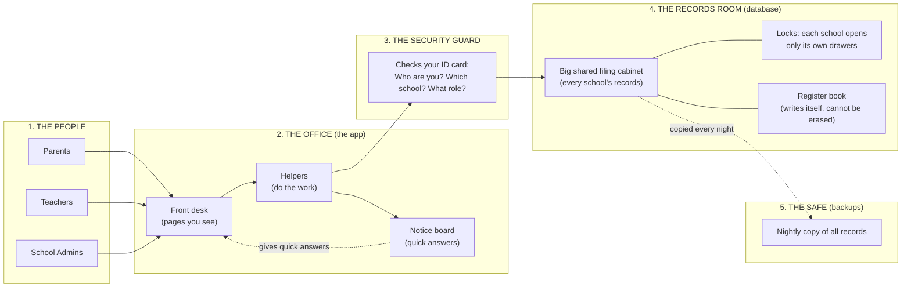
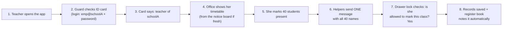

# How Our School SaaS Works — A Simple Guide to the System Design

> Written for **everyone**: school owners, teachers, investors, and developers alike. No technical background needed. If you see a word you don't know, check the [Plain-Words Glossary](#10-plain-words-glossary) at the end.

---

## 1. The System in One Sentence

Our product is one **shared software** that many schools use at the same time — each school logs in, and **only ever sees its own data**. Think of it as one big office building where every school has its own locked room.

**The whole system has just 5 parts:**
1. **The People** — parents, teachers, and admins who use the app.
2. **The Office** — the website/app itself (pages you see + helpers doing the work).
3. **The Security Guard** — checks everyone's ID card before touching any data.
4. **The Records Room** — where all data is stored (one big, locked filing cabinet).
5. **The Safe** — a nightly copy of everything, kept somewhere safe in case of disaster.

That's it. Everything else is detail.

---

## 2. The Big Picture (the map)

Here is the whole system on one page. Each numbered part is explained in plain words right below the diagram.

---

## 3. Reading the Picture — Every Part Explained

### Part 1 — The People (users)

Three types of people use the system:

| Who | Login looks like | What they can do |
|---|---|---|
| **School Admin** | `admin@schoolA` | Everything for their school: students, teachers, fees, sessions, promotions |
| **Teacher** | `emp@schoolA` | Only their own classes: attendance, marks, diary, timetable |
| **Parent** | `reg@schoolA` | Only their own child: diary, fees, attendance, timetable |

One small but important rule: a parent with two children gets **two separate logins** (one per child). This keeps things simple and safe — nobody can ever see another family's data.

### Part 2 — The Office (the app)

The app is like a school office with three parts:

- **Front desk** — the pages you see and click on. It's a modern website (built with a technology called Next.js) that works well on phones and computers.
- **Helpers** — small behind-the-scenes programs that do each job: "enroll this student", "mark attendance", "record this payment". They do the work whenever you press a button.
- **Notice board** — a smart cache. When lots of people look at the same information (like today's timetable), the office posts it on the notice board so it can answer instantly **without opening the records room every time**. The notice board refreshes itself every minute, so the answer is always nearly fresh.

**Why this matters for cost:** answering from the notice board is almost free. Opening the records room costs a little. So we answer from the board whenever we can.

### Part 3 — The Security Guard (login & permissions)

Before anyone touches data, the guard checks the ID card (this is the **login system**, called Supabase Auth). The card says three things:

1. **Who you are** (your login id and password prove it)
2. **Which school you belong to**
3. **What role you have** (admin / teacher / parent)

The guard stamps every request with "this person is from schoolA". From that moment on, every drawer the person touches is checked against that stamp. **The stamp is on the ID card itself (inside the login token), so nobody can fake it** — not even by hacking the website code.

Extra protection: if someone tries the wrong password 5 times, the guard stops letting them try for 15 minutes. There is no "forgot password" link (by design) — the school admin resets passwords, and every reset is recorded.

### Part 4 — The Records Room (the database)

This is where everything lives: students, classes, fees, attendance, marks, diaries, timetables.

- **One big shared filing cabinet.** All schools' data lives in **one database** (a program called PostgreSQL, hosted by Supabase). This is *the* biggest cost-saving decision in the whole design: one cabinet instead of one cabinet per school.
- **Locks on every drawer.** This is the magic part, called **RLS** (Row-Level Security). Every drawer (every row of data) knows which school it belongs to. The lock checks the stamp from the ID card: schoolA's admin can open only schoolA's drawers — **even if a hacker got hold of the keys, they still couldn't open another school's drawers**. It is simply impossible by design.
- **Role locks inside the school:** Admin = master key (all drawers of their school). Teacher = only the drawers for classes they teach (attendance only if they are the class incharge). Parent = only their own child's drawers.
- **The register book (audit log).** Beside the cabinet sits a register book that **writes itself**: every important change (marks edited, fees changed, a student promoted, a payment recorded, a login) is noted automatically by the database itself — not by the app, not by a person. Nobody can skip it or erase it. If there's ever a question — "who changed this mark?" — the book has the answer.

**Two more safety devices inside the records room:**

1. **The "one-form rule" for big moves.** Promoting a student involves several steps (check fees, move to new class, archive the old class, note it in the register). This is done as **one single form**: it either completes completely or is thrown away entirely. A half-completed promotion is impossible — so a student can never get "lost" between sessions.
2. **The "closed files" rule.** Archived sessions (finished school years) are **sealed**: the database itself refuses any change to them. Old records stay readable forever, but nothing in them can ever be edited — not even by an admin.

### Part 5 — The Safe (backups)

Every night, the system **photocopies the entire records room and stores the copies in a safe** (a cheap, secure storage service called Backblaze B2).

- Daily copies are kept for **30 days**; one copy per month is kept for **12 months**.
- If the records room ever burns down, we can rebuild everything in about **an hour**.
- Once every 3 months we do a **practice fire drill**: we restore the copy into a spare room and check the data opens correctly. A backup that has never been tested is not a backup.

**Important:** the free version of Supabase gives **no backups at all**. That is why the nightly safe-copy is non-negotiable from day one — school fee and attendance data cannot be recreated.

---

## 4. A Working Day — Following One Action End to End

Let's watch one teacher mark attendance in the morning. This is the journey of every action in the system:

**What just happened, in plain words:**

1. The teacher types her login id and password.
2. The guard verifies the password and stamps the request: **schoolA, teacher**.
3. The office shows her dashboard — today's timetable, quick links.
4. She opens her class and marks everyone present/absent/late.
5. The helpers send **one single message** with all 40 names to the records room (not 40 separate messages — that would be 40× slower and costlier).
6. The drawer lock checks her permission: she is the class incharge of this class, so yes.
7. The records are written, and the register book automatically notes: "teacher X marked attendance for class 9-A on this date".

**Later that evening**, when parents log in, each parent's drawer lock shows **only their own child's** attendance — even though the request travels through the same office. That is the beauty of the drawer locks: one system, perfectly private for every family.

**Another example — a payment.** The admin records a parent paying 5,000 of a 12,000 fee. One message goes to the records room: the payment is added, the balance is **recalculated by the database itself** (not by the app), and the voucher status automatically becomes "partially paid". Because the database does the math, a double-click can never record the same payment twice.

---

## 5. How Each School's Data Stays Private (the Locks, Explained)

This is the heart of the whole design, so it deserves its own section.

- All schools share **one building** (one database) — that's what keeps cost low.
- Every piece of data has a **school tag** on it (`school_id`).
- **RLS (Row-Level Security)** is the lock system: it checks the tag against the ID-card stamp on every single request. It is built into the database itself, so there is no "back door" in the app that can bypass it.
- The school tag and the role come **from the ID card (login token)**, not from the website. Even if someone builds their own fake website, the token still says which school they truly belong to.

**The promise this gives us:** no matter what bug, mistake, or attack happens, a user from school A **cannot see school B's data**. This is the #1 safety promise of the product, and it is guaranteed by the database, not by good intentions.

---

## 6. What We Fixed from the First Plan (and Why)

The first version of the plan had the same features but a few serious technical problems. Here is what changed, in plain words:

| What changed | How it works now | Why |
|---|---|---|
| **Login system** | One login system (Supabase Auth) that the database understands | The old plan mixed two login systems that couldn't talk to each other — teams end up switching off the drawer locks to make it work, which is dangerous |
| **Parent passwords** | One password per person, stored in one place | The old plan kept parent passwords in two places — messy and less safe |
| **Which class a student is in** | A history table: every transfer and promotion is recorded forever | The old plan only remembered the *current* class — after a promotion you couldn't say what class the child was in last year |
| **"One fee voucher per class per month"** | The database itself refuses a second one | The old plan relied on the app to check — a double-click could break the rule |
| **Fee balances** | The database recalculates the balance after every payment, automatically | The old plan let the app do the math — under pressure it could double-count |
| **Attendance** | One save for the whole class + the database refuses duplicates | The old plan saved student-by-student and could mark the same student twice |
| **Audit trail** | A register book that writes itself inside the database | The old plan logged from the app — a bug could skip logging entirely |
| **Promotion / demotion / transfer** | Done as one single all-or-nothing form | The old plan did steps separately — a failure mid-way could lose a student between school years |
| **Old (archived) sessions** | Sealed by the database | The old plan only hid the edit buttons — a bug could still change sealed data |
| **"Live" updates** | The app checks for updates every 30–60 seconds instead of live-push | The live-push service charges **per message**; checking every minute is free and more than good enough for a school app |
| **Hosting plan** | A clear cost ladder: $22 → $47 → ~$10 per month | The old plan's free hosting is not allowed for paid products by its rules, and had no plan for growth |
| **Backups** | Nightly copies to a safe + quarterly fire drills | The old plan had **no backups at all** — losing school fee records would be a disaster |

**Important:** nothing about the *product* changed. All features work exactly as planned — sessions, classes, students, fees, attendance, marks, diary, timetable, promotions, fee-defaulter blocking, one login per child. We only changed *how* the machinery underneath works, to make it safer, cheaper, and impossible to break.

---

## 7. What It Costs (in Plain Numbers)

The system is designed to cost very little, at every stage:

| Stage | What you get | Cost per month |
|---|---|---|
| **1. Building & testing** | The app running for developers and trial schools | **~$0–1** |
| **2. First paying schools** | The app live, serving roughly **10–15,000 students** (about 20–40 schools) | **~$22** |
| **3. Growing big** | Serving roughly **50–80,000 students** (100–200 schools) | **~$47** |
| **4. Very large / cost-minimized** | Running the records room on our own small server (like owning vs renting) | **~$8–10** |

**The way to think about it:** for the first ~100 schools we *rent* everything (like hiring a professional bookkeeper — easy, no work for us). The total bill stays under **$45/month** the whole time. If we ever pass ~100 schools, we can switch the records room to a cheap server we run ourselves and pay even less — at the cost of a little extra maintenance work.

**Rules we follow so the bill never surprises us:**
- No expensive "live push" service — we check every 30–60 seconds instead.
- The notice board answers repeat questions — fewer trips to the records room.
- No photo/file uploads in version 1 (files are the biggest cost driver) — we add them later only if a school insists.
- Receipts and report cards are **printed straight from the browser** (like printing a webpage) — no paid PDF services.
- Once a month, someone checks the usage dashboards (data size, traffic, users) and we upgrade **before** hitting a limit, not after.

---

## 8. Can It Handle Lots of Users at Once?

Yes — comfortably.

- The busiest moment is the evening, when parents check the app after school. This is a short **burst**, not a constant flood.
- 1,000 people using the app at the same time means roughly **50–100 small questions per second** — like a receptionist answering 100 quick questions a second.
- One records room (database) with good drawer organization can answer **5 times that much** without breaking a sweat.
- The notice board absorbs most of the evening rush, and the office (Vercel) automatically grows and shrinks as needed.

**Rule:** every list screen shows one page at a time (25–50 rows) instead of loading everything — like turning pages of a book instead of dumping the whole book on the table. And during the year-end promotion period, the admin works one student at a time (as the product requires) so nothing can go wrong.

---

## 9. How We Keep It Healthy (Daily Care)

Like any office, the system needs small routines:

- **Updates & testing** — every code change goes through an automatic quality check (a robot called GitHub Actions) before reaching the live system; preview copies are tested first.
- **Smoke detector** — a tool called Sentry catches errors and tells us instantly.
- **Alarm clock** — UptimeRobot pings the app every 5 minutes and alerts us if the login page is unreachable.
- **Monthly bill check** — review data size, traffic, and users; upgrade the plan before hitting limits.
- **Quarterly fire drill** — practice restoring from backups.
- **Weekly security sweep** — automated checks for outdated software and leaked secrets.

---

## 10. Plain-Words Glossary

| Technical word | Plain meaning |
|---|---|
| **SaaS** | Software you rent by subscription; many customers use one shared product |
| **Multi-tenant** | One system serving many schools, each isolated from the others (like one building with locked rooms) |
| **Database / PostgreSQL** | The records room — where all data is stored, in organized drawers (tables) |
| **RLS (Row-Level Security)** | The drawer-lock system inside the database: every row of data checks who may see it |
| **Authentication / Auth** | The login system — checking ID cards (who you are) |
| **Authorization** | The permission checks — what you're allowed to open (your role + school) |
| **JWT / token** | The ID card itself — a safe digital stamp on your login that says who you are, which school, and what role |
| **Cache / notice board** | Keeping recent answers handy so we don't reopen the records room for every single question |
| **Polling** | The app checking for updates on a timer (every 30–60 s) instead of live push |
| **Server / serverless** | The office helpers that do the work; "serverless" means the hosting company runs them for us automatically |
| **Egress / bandwidth** | Data leaving the system (like letters going out of the office) — metered and billed |
| **MAU** | "Monthly Active Users" — the number of people who logged in this month; one of the meter readings we watch |
| **Backup / restore** | The nightly photocopies in the safe, and rebuilding the records room from them after a disaster |
| **RPO / RTO** | "How much data could we lose?" (RPO: up to 1 day) and "how fast can we be back?" (RTO: ~1 hour) |
| **API** | A formal way programs ask each other for things — the office's internal request forms |
| **Trigger** | A rule inside the database that runs automatically when data changes (e.g., recalculating a fee balance, writing the register book) |
| **Transaction** | The one-form rule: several steps complete together or not at all |
| **Vercel** | The hosting company that runs the office (the app) for us |
| **Supabase** | The hosting company that runs the records room (the database) for us |
| **Backblaze B2** | The company that keeps the safe (backup copies) — very cheap |

---

## 11. For the Developers (compact technical summary)

The simple picture above is implemented like this. Details live in `PRD.md` (v2) — sections 0, 6, 7 and 8.

**Identity & locks**
- Supabase Auth (email + password); login ids are `role@schoolSlug`; `role` + `school_id` in `app_metadata` → read by RLS from `auth.jwt()` claims. No NextAuth (incompatible with RLS).
- RLS enabled on every table; every policy starts with the school-scope clause; policy families per role (admin: full school; teacher: own assignments/incharge; parent: own child via `parent_users`).
- `service_role` key server-side only; browser uses anon key.

**Data model (key constraints)**
- `enrollments` replaces `students.current_class_id`; `UNIQUE (student_id, session_id)`.
- `attendance`: `UNIQUE (student_id, session_id, date)`; batch UPSERT per class/day.
- `fee_vouchers`: added `class_id`; partial unique index `(school_id, class_id, session_id, month_year) WHERE type='batch'`; `status` generated column; balance trigger on `fee_payments`.
- `marks_records`: `UNIQUE (marks_entry_id, student_id)`; audit trigger.
- `timetable_entries`: `UNIQUE (class_id, day_of_week, start_time)`.
- Triggers: audit (marks, fees, attendance, enrollments, students), balance recompute, archived-session write guard, `updated_at`.
- RPCs (single transactions, `SECURITY DEFINER`): `promote_student`, `demote_student`, `repeat_student`, `transfer_student`, `record_payment`, `reset_password`.

**App patterns**
- Next.js 14 App Router; server actions for mutations; multi-row writes via RPC.
- TanStack Query polling (30–60 s) + `unstable_cache` (60 s TTL keyed by school) for dashboards; keyset pagination; no Realtime.
- Exports: client-side CSV/XLSX; receipts via print CSS.

**Capacity & cost**
- 1,000 concurrent ≈ 50–100 req/s reads — single Postgres + Supavisor pooling handles 5×. Ladder: ~$22 (Vercel Pro + Supabase Free) → ~$47 (+ Supabase Pro at >400 MB DB / >4 GB egress) → ~$8–10 hybrid VPS. Backups: nightly pg_dump → B2, 30-day + 12-month retention, quarterly restore drill.
- Monitoring: Sentry, UptimeRobot, monthly usage review. CI: GitHub Actions + Vercel previews; migrations in repo.

---

*This guide is the plain-language companion to `PRD.md` (v2). The PRD states what the product must do; this document explains how the machinery works and why it is built that way.*
