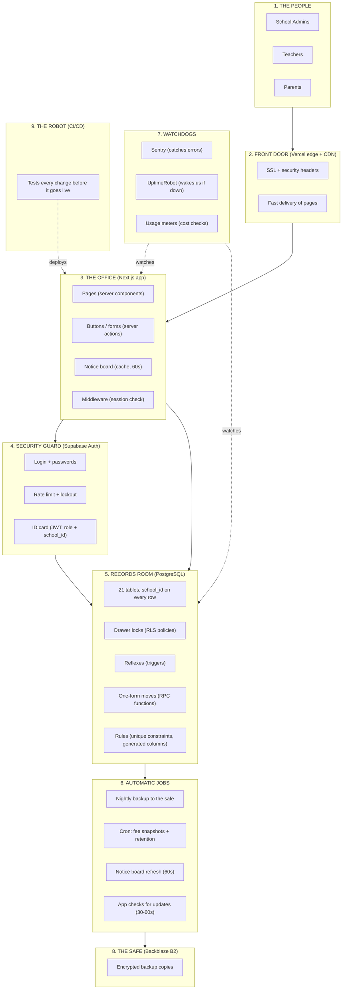

# The Self-Driving Parts — Everything the System Does by Itself

> The system was designed so that **important things happen automatically** — they don't depend on people remembering to do them. This document explains every automatic behavior: what it is, when it runs, and why it matters. Companion to `PRD.md`, `ARCHITECTURE.md`, and `SYSTEM-DESIGN.md`.

---

## 1. In One Sentence

The system watches over itself: it **locks** every door (RLS), **writes its own register book** (audit triggers), **does its own math** (fee balances), **refuses mistakes** (unique constraints), **photocopies itself every night** (backups), and **alerts us when something is wrong** (monitoring) — so humans only do the parts that need judgment (enrolling students, marking attendance, recording payments, promoting students).

---

## 2. The Full System Diagram

This is the complete map — every part of the system, including the automatic jobs and watchdogs. Section 3 explains it.

> Want to see this drawn? Open **`system-diagram.html`** (same folder) in a browser — it renders this diagram plus the automation timeline and the data map, ready to zoom.

---

## 3. Reading the Diagram

| Part | What it is | Does it act by itself? |
|---|---|---|
| 1. The People | Admins, teachers, parents | No — they are the humans |
| 2. Front Door | Delivers pages fast and securely (Vercel CDN + SSL) | Yes — always on, no human needed |
| 3. The Office | Pages, buttons/forms, notice board, session check | Mostly automatic; buttons wait for humans |
| 4. Security Guard | Login, passwords, ID cards (JWT), rate limiting | Yes — checks every request, locks out brute force by itself |
| 5. Records Room | Tables, drawer locks (RLS), reflexes (triggers), one-form moves (RPC), rules (constraints) | Yes — locks, math, register book, and mistake-refusal are 100% automatic |
| 6. Automatic Jobs | Nightly backups, cron jobs, cache refresh, polling | Yes — run on timers, no human needed |
| 7. Watchdogs | Sentry (errors), UptimeRobot (uptime), usage meters (cost) | Yes — watch and alert by themselves |
| 8. The Safe | Encrypted backup copies (Backblaze B2) | Yes — receives copies nightly |
| 9. The Robot | CI/CD: tests every code change before it goes live | Yes — runs on every change, blocks bad code |

---

## 4. Automatic Behaviors — Full List

### A. Instant reflexes (inside the database, on every action — within milliseconds)

| # | Behavior | When it runs | What happens automatically | Why it matters |
|---|---|---|---|---|
| A1 | **Drawer locks (RLS)** | Every single query, always | The database checks the ID card (JWT) and returns only rows of the user's school + role. No app code involved | School A can never see School B — even if the app has a bug or a key leaks |
| A2 | **Register book (audit triggers)** | Every insert/update/delete on marks, fees, attendance, enrollments, students, users | A row is written to `audit_logs`: who, what, when, old value, new value | "Who changed this mark?" is always answerable; nobody can skip or erase the record |
| A3 | **Fee balance math** | Every payment recorded | The database re-sums all payments for the voucher and updates `paid_amount`; status (unpaid/partial/paid) derives itself | Double-clicking can never double-record; the numbers always match the payment history |
| A4 | **Duplicate refusal** | Every insert | The database rejects: same student marked twice on one date, two batch vouchers for one class/month, a student in two classes of one session, two marks rows for one student in one entry, overlapping timetable slots | Mistakes simply cannot happen — no app code needed to prevent them |
| A5 | **Archived-year seal** | Every write touching an archived session | The database raises an error: "Session is archived — read only" | Finished school years can never be edited, even by accident or by an admin |
| A6 | **Timestamp keeper** | Every update | `updated_at` is set automatically | Nobody has to remember to update "last modified" |
| A7 | **Safe deletion rules** | Deleting a marks entry / voucher | Related children rows are removed or blocked (cascade/restrict) | No orphaned records, no deleting a voucher that has payments |

### B. Identity & session automation

| # | Behavior | When it runs | What happens automatically |
|---|---|---|---|
| B1 | **ID card stamping** | At login | Role + school_id are embedded into the token (JWT) — every later request carries them |
| B2 | **Session refresh** | Before the token expires | The middleware refreshes the session silently; the user never notices |
| B3 | **Brute-force lockout** | On failed logins | 5 wrong attempts → 15-minute lockout, by itself |
| B4 | **Revocation on reset** | When an admin resets a password | All old sessions of that user stop working immediately |

### C. Scheduled jobs (run on timers, nobody babysits them)

| # | Job | When | What happens automatically |
|---|---|---|---|
| C1 | **Nightly backup** | Every night | The entire database is copied (encrypted) to the safe (B2); daily copies kept 30 days + monthly copies kept 12 months |
| C2 | **Fee snapshot** | Nightly (cron) | A summary of fee status per class is written — cheap reports, fast dashboards |
| C3 | **Retention job** | Monthly (cron) | Old archived data is packed and moved to cold storage per policy |
| C4 | **Usage check** | Weekly (cron) | Meters are read (data size, egress, users); an email is sent automatically if any meter passes 80% |
| C5 | **Notice board refresh** | Every 60 seconds | Cached dashboard answers expire and refresh on the next request — always nearly fresh |
| C6 | **App polling** | Every 30–60 seconds while the app is open | The app checks for new data (diary, fees, attendance) by itself — no "refresh" button needed |
| C7 | **Restore drill reminder** | Quarterly | The calendar reminds us to practice restoring from backups (the one scheduled job that needs a human to click "go") |

### D. Watchdogs (alert without being asked)

| # | Watchdog | What it does by itself |
|---|---|---|
| D1 | **Sentry** | Catches every error in the app, shows which screen and which code line, emails us |
| D2 | **UptimeRobot** | Pings the health page every 5 minutes; if the app or database is unreachable, it alerts us immediately |
| D3 | **Dependabot** | Checks our software libraries weekly for security updates and opens fix proposals automatically |
| D4 | **CI robot** | On every code change: runs lint, type checks, tests, security scan, and the "school A can't see school B" test — bad code cannot reach the live system |

---

## 5. What Is Automatic vs What Needs a Human

**Simple:** The system does the boring, critical, repetitive work. Humans do the work that needs judgment.

**Detail:**

| The system does BY ITSELF | A human must do |
|---|---|
| Lock every drawer on every request (RLS) | Decide to enroll a student (admin) |
| Write the register book for every change | Mark attendance (teacher) |
| Recalculate fee balances after each payment | Record a payment (admin) |
| Refuse duplicate attendance, duplicate vouchers, double payments | Decide voucher amounts, discounts, fines (admin) |
| Seal archived sessions against edits | Decide promotion/demotion/repeat (admin) |
| Reset-token expiry, session revocation | Decide to reset a password (admin) |
| Nightly backup + retention + usage alerts | Practice the restore drill (us, quarterly) |
| Error capture + uptime alarms + dependency updates | Investigate an alert and fix the cause (us) |
| Cache refresh + polling (always-fresh screens) | Answer support questions (us) |
| Test every code change before deploy | Approve the changes / decide priorities (us) |

---

## 6. A Day in the Life (what happens by itself)

**Simple:** From 7 AM to midnight, the system quietly does dozens of jobs without anyone asking.

**Detail:**

| Time | Automatic events |
|---|---|
| 7:50 AM | Teachers log in — guard checks ID cards, notice board serves timetables instantly |
| 8:00 AM | 50 teachers mark attendance in parallel — drawer locks verify each is the class incharge; the database refuses any duplicate; register book logs every save |
| 10:00 AM | A teacher edits a mark — register book writes itself (who, old, new) |
| 1:00 PM | Admin records 30 payments — each payment triggers balance math; statuses update themselves |
| 4:00 PM | Admin tries a second batch voucher for a class that already has one this month — the database refuses; admin sees a friendly message |
| 6:00–9:00 PM | Evening burst: parents check diary/fees — polling every minute, notice board absorbs the rush, costs stay flat |
| 9:00 PM | A parent double-clicks "pay" — no, they can't; parents don't record payments; and the admin's double-click records once (constraint + trigger) |
| 11:30 PM | Nightly backup job copies everything to the safe, encrypted |
| 11:35 PM | Fee snapshot + usage meters written; retention check runs |
| All day | Sentry watches for errors; UptimeRobot pings every 5 minutes; both would alert us within minutes if anything broke |

---

## 7. What If an Automatic Job Fails?

**Simple:** Watchdogs catch the failures, and the data is always safe in two places (the records room + the night's copy).

**Detail:**

| Automatic job fails | Who notices | What happens |
|---|---|---|
| Nightly backup fails | The backup job itself sends an alert (job failure → email) | The previous night's copy still exists; we fix and re-run the backup that morning |
| A trigger throws (e.g., duplicate, archived write) | The user sees a clear message; Sentry gets a copy | No wrong data — the database refused it, which is exactly its job |
| Cache goes stale | Nothing bad — worst case, data is up to 60 s old | It refreshes automatically on the next request |
| Polling misses an update | The app shows slightly older data | Refetch on window focus + after every action fixes it within seconds |
| Sentry itself fails | UptimeRobot still pings; Supabase/Vercel logs remain | Alerts are layered, not single points |

---

## 8. One-Page Summary

- **Every request** → locked by the database (school + role), no app code involved.
- **Every change** → register book writes itself; duplicates and wrong math are impossible.
- **Every night** → full encrypted copy to the safe; copies kept 30 days + 12 months.
- **Every minute** → notice board refresh; app polls for updates; UptimeRobot pings.
- **Every change to the code** → the robot tests it before it goes live.
- **Every quarter** → we practice restoring from the safe (the one drill that needs us).
- **Result:** the things that must never fail (isolation, accuracy, backups, alerts) never depend on people remembering to do them.

---

*This document pairs with `system-diagram.html` (the drawn version of section 2 and more) and the three main documents: `PRD.md`, `ARCHITECTURE.md`, `SYSTEM-DESIGN.md`.*
