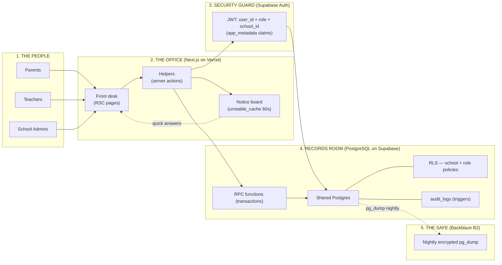
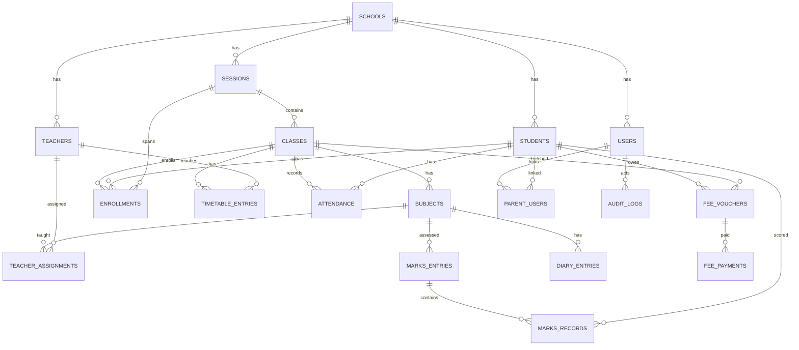

# School Management SaaS — Complete System Design

**The master engineering reference.** This document contains *everything* needed to build the system: full database schema (SQL), all security policies, triggers, functions, authentication flows, performance and cost analysis, failure scenarios, and runbooks.

**How to read it:** every section opens with a **Simple:** line (plain words for anyone) followed by the **Detail:** (full technical depth). The three documents form a set:
- `PRD.md` — *what* the product must do (requirements)
- `ARCHITECTURE.md` — *how it works* in plain language (for everyone)
- `SYSTEM-DESIGN.md` — *this file* — the complete engineering blueprint (for the build team)

---

## Table of Contents

1. [Design Goals](#1-design-goals)
2. [Design Decisions (and Why)](#2-design-decisions-and-why)
3. [Technology Stack](#3-technology-stack)
4. [System Architecture](#4-system-architecture)
5. [Multi-Tenancy & Security Model](#5-multi-tenancy--security-model)
6. [Database Design — Full Schema (DDL)](#6-database-design--full-schema-ddl)
7. [Database Logic — Triggers & Functions](#7-database-logic--triggers--functions)
8. [Application Design](#8-application-design)
9. [Authentication & Session Flows](#9-authentication--session-flows)
10. [API / RPC Catalog](#10-api--rpc-catalog)
11. [Performance & Concurrency](#11-performance--concurrency)
12. [Security Hardening Checklist](#12-security-hardening-checklist)
13. [Reliability — Backups, DR & Runbooks](#13-reliability--backups-dr--runbooks)
14. [Observability & Monitoring](#14-observability--monitoring)
15. [Environments & CI/CD](#15-environments--cicd)
16. [Cost Model & Guardrails](#16-cost-model--guardrails)
17. [Failure Mode Analysis](#17-failure-mode-analysis)
18. [Scaling Roadmap](#18-scaling-roadmap)
19. [Testing Strategy](#19-testing-strategy)
20. [Feature → Table/RPC Map](#20-feature--tablerpc-map)
21. [Resolved Ambiguities & Open Decisions](#21-resolved-ambiguities--open-decisions)

---

## 1. Design Goals

**Simple:** The system must serve many schools with one shared, cheap, safe database — no school ever sees another school's data, nothing important can ever be lost or double-counted, and the bill stays under ~$50/month until 100+ schools.

**Detail:**

| Goal | Metric / Guarantee |
|---|---|
| Multi-tenant isolation | Zero cross-school data access, enforced by the database itself (RLS), never by app code alone |
| Data integrity | No duplicate attendance, no double-recorded payments, no lost students across sessions — enforced by constraints + triggers, not by UI |
| Auditability | Every critical change recorded automatically; cannot be skipped or erased |
| Cost ceiling | ≤ $45/month through ~100 schools (laddered plans, §16) |
| Concurrency | Handles 1,000 concurrent users in evening bursts; p95 < 500 ms |
| Recoverability | RPO ≤ 24 h, RTO ≤ 1 h, quarterly verified restores |
| Simplicity | Fewest moving parts that meet the above — no queues, no Redis, no Realtime, no replicas, no microservices |

---

## 2. Design Decisions (and Why)

**Simple:** Every big choice in this system has one reason: *cheaper, safer, or simpler — usually all three.*

**Detail:**

| # | Decision | Chosen | Rejected | Why |
|---|---|---|---|---|
| D1 | Identity | **Supabase Auth** (email+password) | NextAuth v5 | NextAuth's JWT is not readable by Supabase RLS → teams disable RLS → cross-school leak risk. One identity source that RLS natively understands |
| D2 | Multi-tenancy | **Single shared Postgres**, `school_id` + RLS | DB-per-school | Cheapest correct option; RLS makes isolation stronger than separate DBs (no key to leak) |
| D3 | Data push | **TanStack Query polling** (30–60 s) | Supabase Realtime | Realtime is billed per message and adds complexity; polling is free and sufficient |
| D4 | Multi-step writes | **Postgres RPC functions** (one transaction) | App-level sequential writes | Partial failures lose data (a student between sessions); race conditions corrupt balances |
| D5 | Audit | **DB triggers** | App-level logging | Triggers cannot be skipped by bugs or bypassed via direct DB access |
| D6 | Hosting | **Vercel Pro + Supabase**, later hybrid VPS | Vercel Hobby | Hobby is non-commercial by ToS; tiered ladder keeps cost predictable |
| D7 | Backups | Nightly `pg_dump` → **Backblaze B2** | None / cloud-native only | Supabase Free has no backups; B2 is $6/TB with free egress |
| D8 | Caching | Vercel data cache (60 s TTL per school) + TanStack Query | Redis | School scale doesn't need Redis; server cache absorbs bursts at ~$0 |
| D9 | Files/images | **None in v1** | Storage pipeline | Files are the #1 egress/storage cost; add R2/Supabase Storage only on demand |
| D10 | Payments | **Manual recording** (cash/cheque/bank) | Online gateway | PRD requirement; schema supports a gateway later without redesign |
| D11 | History | **`enrollments` table** (append-only movement) | `current_class_id` | History must survive transfers/promotions |
| D12 | Login ids | **Generated unique ids** (`admin@slug`, `emp<id>@slug`, `reg<roll>@slug`) | Bare `role@slug` examples from PRD | `emp@schoolA`/`reg@schoolA` are not unique per school — the PRD examples were ambiguous; ids must be unique (see §21.1) |

---

## 3. Technology Stack

**Simple:** Modern website framework + one database + login system + cheap backup storage. Everything is a managed service except our own code, so there is almost no server to maintain.

**Detail:**

| Layer | Technology | Version/Notes |
|---|---|---|
| Framework | Next.js (App Router) | 14.x LTS path; React 18; TypeScript strict |
| Styling | Tailwind CSS | v3; no component library (PRD requirement) |
| Client data | TanStack Query | v5; polling + cache invalidation |
| Database | PostgreSQL | 15+ (Supabase-managed) |
| Auth | Supabase Auth | email/password; JWT; built-in rate limiting |
| ORM/Access | supabase-js (anon key + JWT) | PostgREST under the hood; server actions also use it |
| Hosting | Vercel | Pro plan; edge network + serverless functions |
| Cache | Vercel data cache (`unstable_cache`) | 60 s TTL, keyed by school_id |
| Cron | Vercel Cron | nightly jobs (fee snapshots, backup checks) |
| Backups | `pg_dump` + Backblaze B2 | encrypted bucket; rclone or GH Actions |
| Errors | Sentry | free tier (5k events/mo) |
| Uptime | UptimeRobot | free tier, 5 monitors |
| CI/CD | GitHub Actions + Vercel Git | lint, typecheck, tests, secret scan, migrations |
| Load tests | k6 | open-source, in CI or local |

---

## 4. System Architecture

**Simple:** Five parts: people → office (app) → security guard (login) → records room (database) → safe (backups). The guard stamps every request with "which school", and every drawer in the records room only opens for its own school.

**Detail:**

### 4.1 Logical architecture



### 4.2 Request lifecycle (every request, always)

1. Browser/component calls a page, server action, or PostgREST query with the anon key + the user's JWT.
2. Supabase Auth validates the JWT → `auth.uid()` and `auth.jwt()` are populated inside the database.
3. RLS evaluates the policy stack: school claim → role family → row-level rules.
4. Query returns **only** authorized rows. Multi-row writes run inside RPC transactions.
5. Responses for hot aggregate endpoints are served from the notice board (data cache) when fresh.

### 4.3 Deployment topology

- **Production:** Vercel Pro project (1 app) + Supabase project (1 database) + B2 bucket + Sentry + UptimeRobot.
- **Staging:** Vercel preview/staging alias + Supabase free project #2.
- **Local dev:** Supabase CLI (`supabase start` — full local Postgres + Auth) + `next dev`.
- Everything (app, DB, migrations) is versioned in one Git repository.

---

## 5. Multi-Tenancy & Security Model

**Simple:** One building, many locked rooms. The lock reads your ID card: which school you're from and what your role is. School A can never open School B's drawers — this is built into the database, not the app.

**Detail:**

### 5.1 Identity model

- `auth.users` (Supabase) is the **only** password store. `app_metadata` of every user contains:
  ```json
  { "role": "admin|teacher|parent", "school_id": "uuid" }
  ```
  These become JWT claims automatically → RLS reads them from the token (`auth.jwt() -> 'app_metadata'`). No lookup needed, unspoofable.
- `public.users` mirrors each auth user for app queries: `id = auth.users.id`, `school_id`, `role`, `login_id`, `is_active`.

### 5.2 JWT claim shape (what RLS sees)

```sql
-- inside the database, for any authenticated request:
select auth.uid();                                       -- user id
select auth.jwt() -> 'app_metadata' ->> 'role';          -- 'admin' | 'teacher' | 'parent'
select auth.jwt() -> 'app_metadata' ->> 'school_id';     -- uuid, castable to uuid
```

### 5.3 RLS policy inventory (complete)

Every table: `ALTER TABLE ... ENABLE ROW LEVEL SECURITY;` plus the policies below. The **school scope** clause appears in every policy:

```sql
school_id = ((auth.jwt() -> 'app_metadata' ->> 'school_id'))::uuid
```

| Table | Admin | Teacher | Parent |
|---|---|---|---|
| sessions | ALL (school) | SELECT (school) | — |
| classes | ALL (school) | SELECT (school) | SELECT (child's class) |
| subjects | ALL (school) | SELECT (school) | SELECT (child's class) |
| enrollments | ALL (school) | SELECT (own classes) | SELECT (own child) |
| students | ALL (school) | SELECT (own classes) | SELECT (own child) |
| teachers | ALL (school) | SELECT own row | — |
| teacher_assignments | ALL (school) | SELECT (own) | — |
| timetable_entries | ALL (school) | SELECT (own classes) | SELECT (child's class) |
| attendance | ALL (school) | ALL (own incharge class only) | SELECT (own child) |
| marks_entries | ALL (school) | ALL (own subjects) | SELECT (child's class) |
| marks_records | ALL (school) | ALL (own subjects via entries) | SELECT (own child) |
| diary_entries | ALL (school) | ALL (own subjects) | SELECT (child's class) |
| fee_vouchers | ALL (school) | — | SELECT (own child) |
| fee_payments | ALL (school) | — | SELECT (own child) |
| audit_logs | ALL (school) | — | — |
| users | ALL (school) | SELECT own row | SELECT own row |
| parent_users | ALL (school) | — | SELECT own rows |
| school_invites | ALL (school) | — | — |

**Key policy SQL (teacher + parent — the interesting ones):**

```sql
-- Teacher: attendance only for the class they are incharge of
create policy "att_teacher_incharge" on attendance
  for all
  using (class_id in (
    select c.id from classes c
    where c.class_incharge_teacher_id =
          (select id from teachers where user_id = auth.uid())
  ))
  with check (class_id in (
    select c.id from classes c
    where c.class_incharge_teacher_id =
          (select id from teachers where user_id = auth.uid())
  ));

-- Teacher: marks for subjects they teach
create policy "marks_teacher_own_subjects" on marks_records
  for all
  using (marks_entry_id in (
    select me.id from marks_entries me
    join teacher_assignments ta
      on ta.subject_id = me.subject_id and ta.class_id = me.class_id
    where ta.teacher_id = (select id from teachers where user_id = auth.uid())
  ));

-- Parent: own child only
create policy "att_parent_own_child" on attendance
  for select
  using (student_id in (
    select student_id from parent_users where user_id = auth.uid()
  ));

-- Parent: diary of the child's current class
create policy "diary_parent_child_class" on diary_entries
  for select
  using (class_id in (
    select e.class_id from enrollments e
    join parent_users pu on pu.student_id = e.student_id
    where pu.user_id = auth.uid() and e.status = 'active'
  ));
```

> **Rule:** policies only use the JWT claims + small, school-bounded subqueries. Never disable RLS to fix a slow query — add an index instead. RLS policy tests run in CI (§19).

### 5.4 Key exposure rules

| Key | Where | Rules |
|---|---|---|
| `anon` | Browser + server | Safe by design; RLS does the authorization |
| `service_role` | Server env vars ONLY | Never in client bundle; `NEXT_PUBLIC_*` lint check in CI |
| `JWT` (user) | httpOnly cookie | 1 h access token; refresh rotation; revoked on password reset |

---

## 6. Database Design — Full Schema (DDL)

**Simple:** Twenty-one tidy tables. The important tricks: every row knows its school; the database itself refuses duplicates (attendance, vouchers, marks); balances and audit entries are written by the database itself.

**Detail:**

### 6.1 Entity-relationship overview



### 6.2 Full DDL (PostgreSQL 15+)

```sql
-- ============ CORE ============

create table schools (
  id         uuid primary key default gen_random_uuid(),
  name       text not null,
  slug       text not null unique,
  address    text,
  status     text not null default 'active' check (status in ('active','suspended')),
  created_at timestamptz not null default now(),
  updated_at timestamptz not null default now()
);

-- one row per person; id = Supabase auth.users.id
create table users (
  id           uuid primary key references auth.users(id) on delete cascade,
  school_id    uuid not null references schools(id),
  role         text not null check (role in ('admin','teacher','parent')),
  login_id     text not null,           -- e.g. admin@schoolA, emp12@schoolA, reg101@schoolA
  display_name text,
  is_active    boolean not null default true,
  created_at   timestamptz not null default now(),
  updated_at   timestamptz not null default now(),
  unique (school_id, login_id)
);

create table teachers (
  id         bigint generated always as identity primary key,
  school_id  uuid not null references schools(id),
  user_id    uuid not null references users(id),
  name       text not null,
  emp_id     text not null,             -- human-facing employee id
  status     text not null default 'active' check (status in ('active','left')),
  created_at timestamptz not null default now(),
  updated_at timestamptz not null default now(),
  unique (school_id, emp_id),
  unique (user_id)
);

create table students (
  id             bigint generated always as identity primary key,
  school_id      uuid not null references schools(id),
  user_id        uuid not null references users(id),   -- the parent login (v1: one per child)
  name           text not null,
  roll_number    text not null,
  status         text not null default 'active'
                   check (status in ('active','left','suspended','fee_not_paid','fee_defaulter')),
  guardian_name  text,
  guardian_phone text,
  created_at     timestamptz not null default now(),
  updated_at     timestamptz not null default now(),
  unique (school_id, roll_number),
  unique (user_id)
);

-- parent login -> child (one login per child in v1; multiple per parent later)
create table parent_users (
  id         bigint generated always as identity primary key,
  school_id  uuid not null references schools(id),
  user_id    uuid not null references users(id),
  student_id bigint not null references students(id),
  created_at timestamptz not null default now(),
  unique (user_id, student_id)
);

-- ============ ACADEMIC ============

create table sessions (
  id         bigint generated always as identity primary key,
  school_id  uuid not null references schools(id),
  name       text not null,             -- '2025-2026'
  status     text not null default 'active' check (status in ('active','archived')),
  starts_on  date,
  ends_on    date,
  created_at timestamptz not null default now(),
  updated_at timestamptz not null default now(),
  unique (school_id, name)
);

create table classes (
  id                        bigint generated always as identity primary key,
  school_id                 uuid not null references schools(id),
  session_id                bigint not null references sessions(id),
  name                      text not null,               -- '9th'
  section                   text not null default 'A',
  class_incharge_teacher_id bigint references teachers(id),
  status                    text not null default 'active' check (status in ('active','archived')),
  created_at                timestamptz not null default now(),
  updated_at                timestamptz not null default now(),
  unique (school_id, session_id, name, section)
);

create table subjects (
  id         bigint generated always as identity primary key,
  school_id  uuid not null references schools(id),
  class_id   bigint not null references classes(id),
  session_id bigint not null references sessions(id),
  name       text not null,
  created_at timestamptz not null default now(),
  updated_at timestamptz not null default now(),
  unique (school_id, class_id, name)
);

-- membership history: current class = the 'active' row for the current session
create table enrollments (
  id         bigint generated always as identity primary key,
  school_id  uuid not null references schools(id),
  student_id bigint not null references students(id),
  session_id bigint not null references sessions(id),
  class_id   bigint not null references classes(id),
  status     text not null default 'active'
               check (status in ('active','left','transferred','promoted','demoted','repeated')),
  joined_on  date not null default current_date,
  left_on    date,
  created_at timestamptz not null default now(),
  updated_at timestamptz not null default now(),
  unique (student_id, session_id)          -- one class per student per session
);
create index idx_enroll_class_roster on enrollments (school_id, class_id, status);

create table teacher_assignments (
  id         bigint generated always as identity primary key,
  school_id  uuid not null references schools(id),
  teacher_id bigint not null references teachers(id),
  subject_id bigint not null references subjects(id),
  class_id   bigint not null references classes(id),
  session_id bigint not null references sessions(id),
  created_at timestamptz not null default now(),
  unique (school_id, teacher_id, subject_id, class_id, session_id)
);

create table timetable_entries (
  id         bigint generated always as identity primary key,
  school_id  uuid not null references schools(id),
  class_id   bigint not null references classes(id),
  day_of_week smallint not null check (day_of_week between 1 and 7),  -- 1=Mon .. 7=Sun
  start_time time not null,
  end_time   time not null check (end_time > start_time),
  subject_id bigint not null references subjects(id),
  teacher_id bigint references teachers(id),
  created_at timestamptz not null default now(),
  updated_at timestamptz not null default now(),
  unique (school_id, class_id, day_of_week, start_time)
);
-- optional strict teacher-conflict guard (needs btree_gist):
-- create extension if not exists btree_gist;
-- alter table timetable_entries add constraint tt_no_teacher_overlap
--   exclude using gist (teacher_id with =, day_of_week with =,
--                       tstzrange(start_time::timestamp, end_time::timestamp) with &&);

-- ============ DAILY OPERATIONS ============

create table attendance (
  id                   bigint generated always as identity primary key,
  school_id            uuid not null references schools(id),
  session_id           bigint not null references sessions(id),
  class_id             bigint not null references classes(id),
  student_id           bigint not null references students(id),
  date                 date not null,
  status               text not null check (status in ('present','absent','late')),
  marked_by_teacher_id bigint not null references teachers(id),
  created_at           timestamptz not null default now(),
  unique (school_id, student_id, session_id, date)
);
create index idx_attendance_class_date on attendance (school_id, class_id, date);

create table marks_entries (
  id                   bigint generated always as identity primary key,
  school_id            uuid not null references schools(id),
  subject_id           bigint not null references subjects(id),
  class_id             bigint not null references classes(id),
  session_id           bigint not null references sessions(id),
  name                 text not null,                    -- 'Quiz 3'
  total_marks          numeric(6,2) not null check (total_marks > 0),
  date                 date not null default current_date,
  created_by_teacher_id bigint not null references teachers(id),
  created_at           timestamptz not null default now(),
  updated_at           timestamptz not null default now()
);
create index idx_marks_entries_subject on marks_entries (school_id, subject_id, class_id);

create table marks_records (
  id              bigint generated always as identity primary key,
  school_id       uuid not null references schools(id),
  marks_entry_id  bigint not null references marks_entries(id) on delete cascade,
  student_id      bigint not null references students(id),
  marks_obtained  numeric(6,2) not null check (marks_obtained >= 0),
  created_at      timestamptz not null default now(),
  updated_at      timestamptz not null default now(),
  unique (school_id, marks_entry_id, student_id)
);

create table diary_entries (
  id         bigint generated always as identity primary key,
  school_id  uuid not null references schools(id),
  subject_id bigint not null references subjects(id),
  class_id   bigint not null references classes(id),
  session_id bigint not null references sessions(id),
  teacher_id bigint not null references teachers(id),
  date       date not null default current_date,
  content    text not null check (length(content) > 0),
  created_at timestamptz not null default now(),
  updated_at timestamptz not null default now()
);
create index idx_diary_class_date on diary_entries (school_id, class_id, date desc);

-- ============ FEES ============

create table fee_vouchers (
  id           bigint generated always as identity primary key,
  school_id    uuid not null references schools(id),
  student_id   bigint not null references students(id),
  class_id     bigint not null references classes(id),    -- needed for the batch rule
  session_id   bigint not null references sessions(id),
  type         text not null check (type in ('batch','fine')),
  month_year   date not null,                             -- first day of month
  total_amount numeric(12,2) not null check (total_amount >= 0),
  paid_amount  numeric(12,2) not null default 0 check (paid_amount >= 0),
  status       text generated always as (
                 case when paid_amount <= 0 then 'unpaid'
                      when paid_amount < total_amount then 'partial'
                      else 'paid' end) stored,
  issued_by    uuid not null references users(id),
  notes        text,
  created_at   timestamptz not null default now(),
  updated_at   timestamptz not null default now(),
  unique (school_id, student_id, session_id, month_year, type)
);

-- THE business rule, at the database level:
create unique index uq_batch_voucher_class_month
  on fee_vouchers (school_id, class_id, session_id, month_year)
  where type = 'batch';

create table fee_payments (
  id             bigint generated always as identity primary key,
  school_id      uuid not null references schools(id),
  voucher_id     bigint not null references fee_vouchers(id),
  amount_paid    numeric(12,2) not null check (amount_paid > 0),
  payment_date   date not null default current_date,
  payment_method text not null check (payment_method in ('cash','cheque','bank','other')),
  reference_no   text,
  recorded_by    uuid not null references users(id),
  created_at     timestamptz not null default now()
);
create index idx_fee_payments_voucher on fee_payments (school_id, voucher_id);

-- ============ AUDIT & ONBOARDING ============

create table audit_logs (
  id            bigint generated always as identity primary key,
  school_id     uuid not null references schools(id),
  action        text not null,      -- 'marks.update', 'student.promote', 'fee.payment', 'login' ...
  actor_user_id uuid references users(id),
  target_type   text not null,      -- table name
  target_id     bigint,
  old_values    jsonb,
  new_values    jsonb,
  occurred_at   timestamptz not null default now()
);
create index idx_audit_school_time on audit_logs (school_id, occurred_at desc);

create table school_invites (
  id         bigint generated always as identity primary key,
  school_id  uuid not null references schools(id),
  token      text not null unique,
  created_by uuid not null references users(id),
  expires_at timestamptz not null,
  used_at    timestamptz,
  created_at timestamptz not null default now()
);
```

---

## 7. Database Logic — Triggers & Functions

**Simple:** The database has a few automatic reflexes: it stamps every change into the register book, recalculates fee balances after each payment, refuses to edit sealed (archived) years, and performs big moves (like promotion) as one all-or-nothing form.

**Detail:**

### 7.1 Trigger inventory

| Trigger | Table(s) | Fires | Purpose |
|---|---|---|---|
| `trg_updated_at` | all tables with `updated_at` | BEFORE UPDATE | maintain timestamp |
| `trg_audit_marks` | marks_records | AFTER I/U/D | register book |
| `trg_audit_fees` | fee_vouchers, fee_payments | AFTER I/U/D | register book |
| `trg_audit_attendance` | attendance | AFTER I/U/D | register book |
| `trg_audit_moves` | enrollments, students, users | AFTER I/U/D | register book (incl. status changes) |
| `trg_balance` | fee_payments | AFTER I/U/D | recompute voucher `paid_amount` |
| `trg_block_archived` | attendance, marks_records, diary_entries, fee_vouchers, fee_payments, enrollments, timetable_entries | BEFORE I/U/D | reject writes to archived sessions |

### 7.2 Trigger SQL

```sql
-- Generic timestamp keeper
create or replace function fn_set_updated_at() returns trigger as $$
begin
  new.updated_at = now();
  return new;
end $$ language plpgsql;

-- Attach (example):
-- create trigger trg_updated_at before update on students
--   for each row execute function fn_set_updated_at();

-- ============ AUDIT (register book) ============
create or replace function fn_audit_row() returns trigger as $$
begin
  insert into audit_logs (school_id, action, actor_user_id, target_type, target_id, old_values, new_values)
  values (
    coalesce(new.school_id, old.school_id),
    tg_table_name || '.' || lower(tg_op),
    auth.uid(),
    tg_table_name,
    coalesce(old.id, new.id),
    case when tg_op = 'INSERT' then null else to_jsonb(old) end,
    to_jsonb(new)
  );
  return coalesce(new, old);
end $$ language plpgsql security definer;

-- Attach to each audited table:
-- create trigger trg_audit_marks after insert or update or delete on marks_records
--   for each row execute function fn_audit_row();
-- (same for: fee_vouchers, fee_payments, attendance, enrollments, students, users)

-- ============ FEE BALANCE (recompute, atomically) ============
create or replace function fn_recompute_voucher_balance() returns trigger as $$
declare
  v_voucher bigint := coalesce(new.voucher_id, old.voucher_id);
  v_paid    numeric(12,2);
begin
  select coalesce(sum(amount_paid), 0) into v_paid
    from fee_payments where voucher_id = v_voucher;
  update fee_vouchers set paid_amount = v_paid where id = v_voucher;
  return null;
end $$ language plpgsql security definer;

create trigger trg_balance after insert or update or delete on fee_payments
  for each row execute function fn_recompute_voucher_balance();

-- ============ ARCHIVED-SESSION WRITE GUARD ============
create or replace function fn_block_archived_writes() returns trigger as $$
declare
  v_session bigint := coalesce(new.session_id, old.session_id);
begin
  if exists (select 1 from sessions where id = v_session and status = 'archived') then
    raise exception 'Session % is archived - data is read-only', v_session;
  end if;
  return coalesce(new, old);
end $$ language plpgsql;

-- Attach BEFORE INSERT OR UPDATE OR DELETE on every session-bearing table:
-- attendance, marks_records, diary_entries, fee_vouchers, fee_payments,
-- enrollments, timetable_entries
```

### 7.3 RPC functions (the "one-form rule")

All are `SECURITY DEFINER` (run with the definer's rights, bypassing RLS) — **but every function re-checks the caller's role and school from the JWT claims first.** One wrong school → exception.

```sql
-- ============ PROMOTE (also: demote / repeat — same shape, different target class) ============
create or replace function rpc_promote_student(
  p_student_id   bigint,
  p_new_class_id bigint,
  p_new_session_id bigint
) returns void language plpgsql security definer as $$
declare
  v_school      uuid;
  v_role        text;
  v_cur_session bigint;
  v_unpaid      bigint;
begin
  v_role  := auth.jwt() -> 'app_metadata' ->> 'role';
  v_school := (auth.jwt() -> 'app_metadata' ->> 'school_id')::uuid;
  if v_role <> 'admin' then raise exception 'Admin role required'; end if;
  if not exists (select 1 from students where id = p_student_id and school_id = v_school) then
    raise exception 'Access denied';
  end if;

  select session_id into v_cur_session from enrollments
   where student_id = p_student_id and status = 'active';

  -- fee check INSIDE the transaction, with row locks (no race with payments)
  select count(*) into v_unpaid from fee_vouchers
   where student_id = p_student_id and session_id = v_cur_session
     and paid_amount < total_amount
   for update;
  if v_unpaid > 0 then raise exception 'Outstanding fees - promotion blocked'; end if;

  -- move the student (all-or-nothing)
  update enrollments set status = 'promoted', left_on = current_date
   where student_id = p_student_id and status = 'active';
  insert into enrollments (school_id, student_id, session_id, class_id)
   values (v_school, p_student_id, p_new_session_id, p_new_class_id);

  -- archive the old class if empty
  update classes set status = 'archived'
   where school_id = v_school
     and not exists (select 1 from enrollments
                     where class_id = classes.id and status = 'active');

  insert into audit_logs (school_id, action, actor_user_id, target_type, target_id, new_values)
   values (v_school, 'student.promote', auth.uid(), 'enrollments', p_student_id,
           jsonb_build_object('new_class_id', p_new_class_id, 'new_session_id', p_new_session_id));
end $$;

grant execute on function rpc_promote_student(bigint, bigint, bigint) to authenticated;

-- ============ TRANSFER (same session) ============
create or replace function rpc_transfer_student(
  p_student_id   bigint,
  p_new_class_id bigint
) returns void language plpgsql security definer as $$
declare
  v_school uuid; v_role text;
begin
  v_role  := auth.jwt() -> 'app_metadata' ->> 'role';
  v_school := (auth.jwt() -> 'app_metadata' ->> 'school_id')::uuid;
  if v_role <> 'admin' then raise exception 'Admin role required'; end if;

  update enrollments
     set class_id = p_new_class_id,
         updated_at = now()
   where student_id = p_student_id and status = 'active'
     and school_id = v_school;
  if not found then raise exception 'Active enrollment not found'; end if;

  insert into audit_logs (school_id, action, actor_user_id, target_type, target_id, new_values)
   values (v_school, 'student.transfer', auth.uid(), 'enrollments', p_student_id,
           jsonb_build_object('new_class_id', p_new_class_id));
end $$;

-- ============ RECORD PAYMENT (balance auto-updates via trigger) ============
create or replace function rpc_record_payment(
  p_voucher_id bigint,
  p_amount      numeric,
  p_method      text,
  p_reference   text default null
) returns void language plpgsql security definer as $$
declare
  v_school uuid; v_role text;
begin
  v_role  := auth.jwt() -> 'app_metadata' ->> 'role';
  v_school := (auth.jwt() -> 'app_metadata' ->> 'school_id')::uuid;
  if v_role <> 'admin' then raise exception 'Admin role required'; end if;
  if not exists (select 1 from fee_vouchers where id = p_voucher_id and school_id = v_school) then
    raise exception 'Access denied';
  end if;

  insert into fee_payments (school_id, voucher_id, amount_paid, payment_method, reference_no, recorded_by)
   values (v_school, p_voucher_id, p_amount, p_method, p_reference, auth.uid());
  -- fn_recompute_voucher_balance runs automatically; status column derives itself.
end $$;

-- ============ ISSUE BATCH VOUCHERS (one per class per month, guaranteed) ============
create or replace function rpc_issue_batch_vouchers(
  p_class_id    bigint,
  p_month_year  date,
  p_amount      numeric,
  p_notes       text default null
) returns int language plpgsql security definer as $$
declare
  v_school uuid; v_role text; v_session bigint; v_count int;
begin
  v_role  := auth.jwt() -> 'app_metadata' ->> 'role';
  v_school := (auth.jwt() -> 'app_metadata' ->> 'school_id')::uuid;
  if v_role <> 'admin' then raise exception 'Admin role required'; end if;

  select session_id into v_session from classes
   where id = p_class_id and school_id = v_school;
  if v_session is null then raise exception 'Access denied'; end if;

  -- The partial unique index raises an error if a batch for this class+month exists.
  insert into fee_vouchers (school_id, student_id, class_id, session_id, type,
                            month_year, total_amount, issued_by, notes)
  select v_school, e.student_id, e.class_id, e.session_id, 'batch',
         p_month_year, p_amount, auth.uid(), p_notes
    from enrollments e
   where e.class_id = p_class_id and e.status = 'active';

  get diagnostics v_count = row_count;
  insert into audit_logs (school_id, action, actor_user_id, target_type, target_id, new_values)
   values (v_school, 'fee.batch_issue', auth.uid(), 'classes', p_class_id,
           jsonb_build_object('count', v_count, 'month', p_month_year, 'amount', p_amount));
  return v_count;
end $$;
```

**RPC catalog (complete list)** — see §10 for signatures.

> **Implementation note (password reset):** resetting a password touches `auth.users`, which app-level RPCs cannot modify. The server action uses the `service_role` key: `auth.admin.updateUserById(id, { password })` (Supabase admin API), then writes the audit row. This is the only `service_role` use case besides school bootstrap.

---

## 8. Application Design

**Simple:** Pages are mostly pre-made on the server (fast, cheap), buttons call small helper actions, and the app checks for updates every minute instead of pushing. Lists show one page at a time.

**Detail:**

### 8.1 Next.js structure

```
app/
  (auth)/login/page.tsx
  (portal)/
    admin/...        teacher/...        parent/...
    _actions/        # server actions (mutations) - one file per domain
  api/health/route.ts
lib/
  supabase/server.ts     # per-request server client (anon key + user JWT from cookie)
  supabase/client.ts     # browser client (anon key only)
  queries/               # typed data-fetch functions (server)
  rpc/                   # typed wrappers around RPC functions
  cache.ts               # unstable_cache helpers keyed by school_id
db/migrations/           # SQL files (supabase/migrations)
docs/runbook.md          # restore & incident procedures
```

**Rules:**
- **Pages = React Server Components.** Queries run server-side through `lib/supabase/server.ts` (RLS applies). No client fetch waterfalls.
- **Mutations = Server Actions** → thin validation (zod) → call RPC or server query. The server action reads the session itself; RLS remains the last line of defense.
- **Never put `school_id` in URLs** — it always comes from the JWT claim.
- **Middleware**: refreshes the Supabase session cookie; redirects by role claim (`/admin`, `/teacher`, `/parent`).

### 8.2 Data fetching & caching policy

| Data | TanStack `staleTime` | Server cache TTL | Refetch |
|---|---|---|---|
| Timetable, subjects, class rosters | 5 min | 5 min | on mutation |
| Dashboard stats | 60 s | 60 s (`unstable_cache` keyed by school_id) | poll 60 s |
| Diary feed | 30 s | — | poll 60 s + window focus |
| Marks grids | 30 s | — | on mutation |
| Fee ledger | 30 s | — | on mutation |
| Audit logs | 0 | — | manual (paginated) |

```ts
// lib/cache.ts — notice board pattern
import { unstable_cache } from "next/cache";

export const cachedSchoolStats = (schoolId: string) =>
  unstable_cache(
    async () => fetchDashboardStats(schoolId),   // one aggregate SQL query
    ["school-stats", schoolId],
    { revalidate: 60 },
  );
```

### 8.3 Pagination (keyset — stable under live data)

```sql
-- page 2 of audit logs after cursor (school_id=..., occurred_at=..., id=...)
select * from audit_logs
 where school_id = $1
   and (occurred_at, id) < ($2, $3)
 order by occurred_at desc, id desc
 limit 50;
```

### 8.4 Batch operations (never loop per student)

```sql
-- Attendance: ONE UPSERT for the whole class
insert into attendance (school_id, session_id, class_id, student_id, date, status, marked_by_teacher_id)
select $school, $session, $class, s.id, current_date, v.status, $teacher
  from unnest($student_ids::bigint[], $statuses::text[]) as v(id, status)
  join students s on s.id = v.id
on conflict (school_id, student_id, session_id, date)
do update set status = excluded.status, marked_by_teacher_id = excluded.marked_by_teacher_id;

-- Marks entry: one multi-row insert for all students
-- Batch vouchers: rpc_issue_batch_vouchers (§7.3) — one INSERT..SELECT for the class
```

### 8.5 Exports & printing

- Audit log → Excel: **client-side SheetJS** (< 10k rows) or **streaming CSV** (large).
- Receipts & report cards: **print CSS** (`@media print`) — zero server cost.
- Never build large `.xlsx` inside serverless functions (memory limits).

### 8.6 Error handling

- Server actions: zod validation → typed errors → toast messages; unexpected errors → generic message + Sentry capture.
- DB exceptions (e.g., "Session archived", "Outstanding fees", duplicate batch voucher) → mapped to friendly, actionable messages (the exception message is user-safe by design).
- Global error boundary per portal; health endpoint `/api/health` checks DB connectivity (used by UptimeRobot).

---

## 9. Authentication & Session Flows

**Simple:** Everyone gets an ID card (login + password). The card says who they are, which school, and what role. Passwords can only be reset by the school admin. New schools get a one-time invite link.

**Detail:**

### 9.1 Login flow

1. `signInWithPassword({ email: loginId, password })` (Supabase Auth).
2. Auth verifies against `auth.users` (rate-limited: 5 failures → 15-min lockout per IP/account).
3. Returns access token (1 h) + refresh token; `app_metadata` claims embedded.
4. App sets `httpOnly`, `Secure`, `SameSite=Lax` cookie (`sb-*`).
5. Middleware refreshes the token before expiry; on refresh failure → redirect to login.
6. Server logs `audit_logs` row: action `login`, actor, occurred_at, plus IP (stored in a separate field via `new_values`).

### 9.2 Admin password reset (no forgot-password)

1. Admin calls server action with target user id + temporary password.
2. Action checks session role = admin (server-side) → `auth.admin.updateUserById(id, { password })` with `service_role`.
3. Audit row written (`user.password_reset`).
4. Admin hands the temporary password to the user in person / school channel.

### 9.3 School bootstrap & admin invite

1. SaaS operator creates the school row + invite token (`school_invites`, 72 h expiry) — via a server-only script using `service_role`.
2. Invitee opens `/invite?token=…`, sets the admin password → auth user created with `app_metadata { role: 'admin', school_id }` → `users` row inserted.
3. Token marked `used_at`; new tokens can be issued by the school admin for teachers (and by the admin for parents at enrollment — parent auth users are created at enrollment time with a temp password, exactly like PRD's "admin sets parent password").

### 9.4 Session revocation

- Password reset → `auth.admin.updateUserById` invalidates existing refresh tokens for that user.
- `is_active = false` on `users` → middleware + RLS (`users.is_active` check inside role-family policies where needed) block access.
- Logout → `signOut()` + cookie clear.

---

## 10. API / RPC Catalog

**Simple:** A short list of "special moves" that must happen atomically — everything else is ordinary read/write on tables.

**Detail:**

| Function | Params | Returns | Guards |
|---|---|---|---|
| `rpc_enroll_student` | student name, roll, class_id, parent login, temp password | student_id | admin; creates auth user (service role, app-side) + student + parent_users + enrollment |
| `rpc_transfer_student` | student_id, new_class_id | void | admin; same session; updates active enrollment |
| `rpc_promote_student` | student_id, new_class_id, new_session_id | void | admin; fee check w/ locks; archives empty class |
| `rpc_demote_student` | same as promote | void | admin; fee check; lower class |
| `rpc_repeat_student` | same as promote | void | admin; fee check; same class level |
| `rpc_issue_batch_vouchers` | class_id, month_year, amount, notes | count | admin; partial unique index = one per class/month |
| `rpc_edit_voucher` | voucher_id, new_total, notes | void | admin; audit trigger records old/new |
| `rpc_record_payment` | voucher_id, amount, method, reference | void | admin; trigger recomputes balance |
| `rpc_set_student_status` | student_id, new_status | void | admin; audit trigger |
| `rpc_reset_password` | user_id, temp_password | void | admin; uses `auth.admin.updateUserById` (service role, app-side orchestration) |
| `rpc_archive_class` | class_id | void | admin; only when no active enrollments |
| `rpc_archive_session` | session_id | void | admin; only when all classes archived |

Ordinary CRUD (sessions, classes, subjects, teachers, assignments, timetable, diary, marks entries/records) uses direct PostgREST/table access — RLS is the authorizer.

---

## 11. Performance & Concurrency

**Simple:** The busiest moment is parents logging in after school — a short burst, not a flood. One database with good organization handles 5× more than we need; the notice board absorbs most of the rush anyway.

**Detail:**

### 11.1 Capacity math

- 1,000 concurrent users, mostly read-only JSON (5–20 KB) ≈ **50–100 req/s**, ~1–2 MB/s.
- Postgres single instance: 5,000+ read tps with proper indexes → **5× headroom**.
- Supavisor (pooler, transaction mode, port 6543) absorbs connection churn from serverless — use it from day one.
- Vercel serverless auto-scales; the 60 s data cache turns repeat reads into edge hits.
- **Conclusion:** no queues, no replicas, no sharding at this scale. Revisit only at ~500+ schools or heavy year-end reporting.

### 11.2 Hot-path rules

1. No N+1 — batch joins in one query; never query inside `.map()`.
2. School scope from JWT claim (no subquery) in the hot path; role subqueries are bounded by school size.
3. Dashboards via `cachedSchoolStats` (§8.2) — one aggregate query per minute at most.
4. Attendance/marks/batch vouchers = single-statement writes (§8.4).
5. Keyset pagination everywhere (§8.3).
6. `EXPLAIN ANALYZE` gate in CI for the 10 heaviest queries (list in §19).

### 11.3 Load test (k6) — run before Phase 6 sign-off

- Scenario A: 1,000 VUs hit the parent dashboard + diary for 15 min (evening burst). Assert p95 < 500 ms, error rate < 0.1%.
- Scenario B: 50 teachers marking attendance concurrently (morning peak). Assert no unique-constraint errors, p95 < 800 ms.
- Scenario C: admin issues batch vouchers for 3 large classes concurrently. Assert exactly one voucher per student, one batch per class/month.

---

## 12. Security Hardening Checklist

**Simple:** Locks everywhere, keys in the right pockets, and a register book that can't be erased.

**Detail:**

- [ ] RLS enabled on every table; every policy begins with the school claim; CI test asserts this (query `pg_policies`).
- [ ] `service_role` only in server env; CI lint fails on `NEXT_PUBLIC_*` variables named like service keys.
- [ ] Supabase Auth defaults on: rate limiting, lockout, email confirmation off (login ids aren't real emails — document this choice).
- [ ] Session cookie: httpOnly + Secure + SameSite=Lax; access token 1 h; refresh rotation; revocation on reset.
- [ ] Password policy: ≥ 8 chars, mixed case + digit, enforced client + server.
- [ ] Security headers: CSP (`default-src 'self'`), X-Frame-Options DENY, X-Content-Type-Options nosniff, Referrer-Policy no-referrer, HSTS (Vercel handles TLS).
- [ ] Invite tokens: 72 h expiry, single use, no default passwords anywhere.
- [ ] Audit: trigger-based (§7.2) + login audit (§9.1); retention 3 years then B2 cold.
- [ ] Archived sessions write-blocked by trigger (§7.2).
- [ ] Backups encrypted (B2 SSE); credentials in repo secrets only; `git secrets` scan in CI.
- [ ] Dependency hygiene: Dependabot weekly, `npm audit` in CI, lockfile pinned.
- [ ] Rate limiting on login (Auth built-in) + optional app-level limiter (Vercel KV) on server actions.
- [ ] Input validation: zod on every server action; JSONB in audit rows is app-generated only.
- [ ] RLS policy tests in CI (create users of each role in a test project; assert row visibility — §19).

---

## 13. Reliability — Backups, DR & Runbooks

**Simple:** Every night the records room is photocopied into a safe. If the records room burns down, we can rebuild everything in about an hour — and we practice that every 3 months.

**Detail:**

### 13.1 Backup matrix

| Tier | Mechanism | Retention | RPO | RTO |
|---|---|---|---|---|
| Free (launch) | nightly `pg_dump` (GitHub Action cron or VPS cron) → B2, encrypted | 30 days daily + 12 monthly | ≤ 24 h | ~1 h |
| Pro | Supabase daily backups (7 d) + optional PITR + nightly dump → B2 | 7 d + 12 months | ~1 h (PITR) | ~1 h |
| VPS | pgBackRest (full + WAL archiving) → B2 | 30 d + 12 months | ~1 h | ~2 h |

### 13.2 Restore runbook (abbreviated — full version in `docs/runbook.md`)

1. Create a fresh Supabase project (or start a local one for drills).
2. `pg_restore` / `psql < dump` into it; run migrations if dump predates schema changes.
3. Point staging env vars (anon, URL) at the restored project.
4. Verify: login as admin → open student list → open fee ledger → check a marks entry with audit history.
5. For production DR: update Vercel env vars, redeploy, verify `/api/health` + one login per role.
6. Time-box the whole drill to 1 hour; log the result in the repo.

### 13.3 Data retention

- Archived sessions: keep online 3 years → then export to B2 cold (JSON/CSV per school) and optionally drop from the live DB.
- `audit_logs`: 3 years online → B2 cold.
- Retention is a scheduled Vercel Cron job + monthly manual review.

---

## 14. Observability & Monitoring

**Simple:** A smoke detector (errors), an alarm clock (uptime), and a monthly meter reading (costs). Plus the register book inside the app for business questions.

**Detail:**

| Tool | Monitors | Alerts |
|---|---|---|
| Sentry (free tier) | client + server exceptions | on 5xx / unhandled errors |
| UptimeRobot | `/api/health` (DB connectivity) | down > 2 min → email/WhatsApp |
| Supabase dashboard | DB size, egress, MAU, function usage | weekly review + calendar at 80% |
| Vercel dashboard | bandwidth, invocations, build minutes | weekly review |
| `audit_logs` | business-level traceability | — (query for investigations) |
| Cron check job | Supabase usage API | email when any meter > 80% of quota |

---

## 15. Environments & CI/CD

**Simple:** Changes are tested by a robot before they reach the live system; the database changes are version-controlled like code.

**Detail:**

```
branches:  main → production (Vercel)
           develop → staging (Supabase free project #2)
           feature/* → Vercel preview deployments
migrations: db/migrations/NNN_*.sql in repo
            CI: supabase db push to staging on merge to develop
                manual review + supabase db push to prod (or CI job with approval)
```

- GitHub Actions on every PR: `pnpm lint` → `tsc --noEmit` → `vitest run` → `npm audit` → secret scan → RLS policy tests (§19).
- Never hand-apply SQL to production. Every schema change is a migration file.
- Env vars per environment in Vercel/Supabase; `.env.local` gitignored.
- Local dev: `supabase start` (local Postgres + Auth) — zero cloud cost during development.

---

## 16. Cost Model & Guardrails

**Simple:** Rent everything until ~100 schools (~$22–47/month), then optionally run the records room on a cheap server we own (~$8–10/month). A few rules keep the bill from ever surprising us.

**Detail:**

### 16.1 Tiers (verified Jul–Aug 2026 — re-verify before purchase)

| Tier | App | DB | Backups | Total/mo | Capacity |
|---|---|---|---|---|---|
| 0 Dev/Pilot | Vercel Hobby $0 (non-commercial) | Supabase Free $0 | B2 ~$1 | ~$1 | dev + pilots |
| 1 Launch | Vercel Pro $20 | Supabase Free $0 | B2 ~$2 | ~$22 | ~10–15k students / 20–40 schools |
| 2 Growth | Vercel Pro $20 | Supabase Pro $25 | B2 ~$2 | ~$47 | ~50–80k students |
| 3 Hybrid | Cloudflare Pages $0 (commercial OK) | Hetzner CX22 ~$5 | B2 ~$2 | ~$8–10 | near-unlimited DB |

### 16.2 Upgrade triggers

- Supabase Pro when: DB size > 400 MB (of 500 MB free) **or** egress > 4 GB/month (of 5 GB) **or** MAU > 40k.
- Vercel Pro is required from the first paying school (ToS).
- Tier 3 (hybrid/VPS) when managed costs > ~$50/month (≈ 100+ schools).

### 16.3 Sizing math (why Free fits launch)

- Attendance dominates: ~60–70 B/row × ~2.5 index overhead ≈ 170 B.
- 10k students × 200 days = 2M rows ≈ **340 MB**. 15k students ≈ 500 MB. → "10–15k students per 500 MB" is the honest Free-tier ceiling.
- Egress: 5 GB free ≈ ~3–5k active parents with 2–5 min polling + server cache (biggest lever: `cachedSchoolStats` + staleTime).

### 16.4 Guardrails (non-negotiable)

1. No Realtime, no Redis, no per-school DBs, no replicas, no multi-region.
2. No files/images in v1; when needed → Cloudflare R2 ($0 egress) or Supabase Storage.
3. Polling ≥ 30 s; dashboards cached 60 s server-side.
4. Batch single-statement writes; keyset pagination on all lists.
5. Exports client-side; receipts via print CSS.
6. Monthly usage review; upgrade **before** hitting caps.
7. Vercel Cron (nightly jobs) within plan; avoid paid cron add-ons.

---

## 17. Failure Mode Analysis

**Simple:** We listed every "what if something goes wrong" scenario and who/what catches it. Nothing is left to hope.

**Detail:**

| Scenario | Impact | Detection | Mitigation |
|---|---|---|---|
| School B user tries to read school A data | Data leak | — (prevented) | RLS school claim; verified by CI policy tests; leaked anon key harmless |
| Teacher edits marks without permission | Data breach | — (prevented) | RLS teacher policy (own subjects only) |
| Double-click on "record payment" | Duplicate payment | — (prevented) | Payments insert once; balance trigger; audit trail shows both attempts |
| Two admins issue batch voucher same month | Double vouchers | — (prevented) | Partial unique index raises error; user sees friendly message |
| Attendance marked twice for same student | Duplicate | — (prevented) | Unique constraint; UPSERT overwrites with latest status |
| Crash mid-promotion | Lost student | — (prevented) | Single transaction RPC: all-or-nothing |
| Admin edits archived session data | Corrupted history | — (prevented) | Archived-session write guard trigger |
| Database disk full / project paused (Free tier) | Outage | UptimeRobot | Upgrade Pro before 400 MB; nightly backups elsewhere |
| Total database loss | Data loss | Sentry/alert | Restore from B2 (runbook, RTO ~1 h); quarterly drill |
| Login brute force | Account takeover | Auth logs | Built-in rate limiting + lockout; login audit |
| Vercel incident (app down) | Outage | UptimeRobot | Vercel SLA; static fallback page; keep Hobby project as instant fallback host? (note: not a full DR, just front-end) |
| Vercel/Supabase price change | Cost jump | monthly review | Architecture is vendor-portable (Supabase ↔ Neon ↔ own Postgres; Vercel ↔ Cloudflare Pages ↔ VPS) |
| Key person leaves | Bus stop | — | All docs in repo (this design + PRD + runbook); infra is managed services |
| School stops paying | Churn | billing review | Block admin access, never delete data; offer data export first |

---

## 18. Scaling Roadmap

**Simple:** We start rented and small, and only add machinery when the numbers demand it.

**Detail:**

| Trigger | Action |
|---|---|
| First paying school | Move to Tier 1 (Vercel Pro) |
| DB > 400 MB or egress > 4 GB | Move to Tier 2 (Supabase Pro + PITR) |
| ~100 schools / managed cost > $50/mo | Move DB to Tier 3 (Hetzner CX22 + pgBackRest + B2); keep app on Vercel/Cloudflare |
| Heavy year-end reporting slows admin dashboard | Add one read replica *only* for report queries, or precompute `school_stats` table via triggers (preferred first step) |
| 500+ schools / > 1 TB data | Evaluate: read replica for reporting, partition `attendance` by session_id, cold-archive older sessions to B2 (retention policy §13.3) |
| Multi-region requirement (legal/latency) | Only then: region per school cluster + cross-region backups — a 2027+ problem, not v1 |

---

## 19. Testing Strategy

**Simple:** Tests at four levels: tiny unit tests, integration tests against a real (local) database, RLS "spy" tests that prove school A can't see school B, and load tests that simulate the evening rush.

**Detail:**

| Level | What | Tool |
|---|---|---|
| Unit | server action validators, helpers, status mapping | Vitest |
| Integration | RPC functions, triggers (balance, audit, archival guard), constraints (batch voucher, attendance unique) | Vitest + local Supabase (`supabase start`) |
| **RLS policy tests** | Create 3 users (admin/teacher/parent) in 2 schools in a test DB; assert: cross-school queries return 0 rows; teacher sees only own classes; parent sees only own child; unauthenticated = 0 rows; service_role not used in tests | Vitest + pg policies assertion; CI job checks `pg_policies` for every table |
| E2E | login → portal → core flows (attendance, marks edit w/ audit, fee payment, promotion) | Playwright |
| Load | §11.3 scenarios | k6 |
| Migration | `supabase db push` applied cleanly to staging; rollback path = revert migration file + re-push (keep migrations additive) | CI |

---

## 20. Feature → Table/RPC Map

**Simple:** A checklist showing where every product feature lives in the data — useful during development so nothing is forgotten.

**Detail:**

| Feature (PRD §) | Tables | RPC / action | Notes |
|---|---|---|---|
| Sessions CRUD + archive (§4.1) | sessions | rpc_archive_session | unique name/school |
| Classes CRUD + incharge (§4.2) | classes | — | incharge nullable |
| Subjects per class (§4.3) | subjects | — | unique per class/session |
| Enroll / status / transfer (§4.4) | students, enrollments, parent_users, users | rpc_enroll_student, rpc_transfer_student, rpc_set_student_status | parent auth user created at enrollment |
| Teachers + assignments (§4.5) | teachers, teacher_assignments | — | soft-delete via status |
| Batch vouchers / edits / fines (§4.6) | fee_vouchers | rpc_issue_batch_vouchers, rpc_edit_voucher | partial unique index |
| Payments + balance (§4.6) | fee_payments, fee_vouchers | rpc_record_payment | trigger recompute; generated status |
| Defaulter blocking (§4.6) | students.status | rpc_set_student_status | parent portal overlay |
| Attendance (§4.7) | attendance | batch UPSERT (server action) | unique + incharge RLS |
| Marks + edit logs (§4.8) | marks_entries, marks_records, audit_logs | — | audit trigger |
| Diary (§4.9) | diary_entries | — | parent sees child's class |
| Timetable (§4.10) | timetable_entries | — | slot uniqueness + teacher conflict check |
| Promotion/demotion/repeat (§4.11) | enrollments, classes, fee_vouchers, audit_logs | rpc_promote/demote/repeat | fee check + locks |
| Audit export (§5.1) | audit_logs | client-side XLSX / CSV | keyset pagination |
| Admin reset password (§5.1) | users, auth.users | rpc_reset_password (service role) | audited |
| Invite onboarding | school_invites, auth.users | server-only bootstrap | 72 h token |
| Dashboards | aggregate queries | cachedSchoolStats | 60 s cache |
| Login audit | audit_logs | server action after sign-in | IP in new_values |

---

## 21. Resolved Ambiguities & Open Decisions

**Simple:** A few places where the PRD wasn't specific — we made a choice; three questions remain for the product owner.

**Detail:**

### 21.1 Resolved ambiguities

1. **Login ids must be unique per person.** PRD examples (`emp@schoolA`, `reg@schoolA`) imply one id per role, which is impossible. Resolution: `admin@<slug>` (one), `emp<id>@<slug>` (e.g., `emp12@schoolA` — id from a per-school sequence), `reg<roll>@<slug>` (e.g., `reg101@schoolA`; roll numbers are unique per school). Local parts are alphanumeric to satisfy email validation.
2. **Parent "user" vs student "user".** Each student row links (via `user_id` + `parent_users`) to a `role='parent'` auth user created at enrollment. v1 = one parent login per child; the schema supports several children per parent later without migration.
3. **Attendance after transfer.** The unique key is `(school_id, student_id, session_id, date)` — attendance follows the student within a session; `class_id` on the row reflects the class at marking time.
4. **Batch voucher rule scope.** "One per class per month" is per *session* (sessions never overlap), enforced by the partial unique index including `session_id`.
5. **Fee edit after payments.** Admins may change `total_amount`; if new total ≤ paid, status auto-derives to `paid`. The audit trigger records every change.

### 21.2 Open decisions (need product owner input)

1. Region for hosting (e.g., `ap-south-1` vs `us-east-1`) — affects latency for schools and backup placement.
2. Whether v1 needs a public landing/signup page for self-serve school onboarding (vs sales-assisted invites only).
3. Data retention specifics: confirm 3-years-online + B2 cold archive policy (§13.3).
4. Multi-child parent accounts: keep per-child logins in v1? (Recommended: yes.)
5. Report cards: confirm print-CSS-only for v1 (no PDF service).
6. Future online payments: schema supports adding a gateway — confirm manual-only for v1.

---

*This design is complete for v1. Anything not specified here is either deliberately deferred (§18) or marked as an open decision (§21.2). Keep `PRD.md`, `ARCHITECTURE.md`, and this document in sync as decisions change.*
