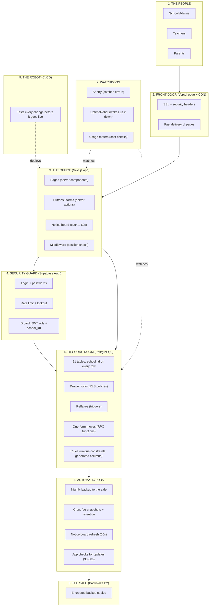

# Complete Diagram + Notes — How It Works and Why Each Part Is Needed

> For everyone: the full picture, then part-by-part notes explaining **how** each piece works and **why** it exists — including what would happen without it. Companion to `PRD.md`, `ARCHITECTURE.md`, `SYSTEM-DESIGN.md`, `AUTOMATION.md`, `TEAM-BRIEF.md`.

---

## 1. The Complete Diagram



---

## 2. Part-by-Part Notes — How & Why

### Part 1 — The People

| | |
|---|---|
| **What it is** | The three types of users: School Admins, Teachers, Parents |
| **How it works** | Each role has its own login format (`admin@schoolA`, `emp12@schoolA`, `reg101@schoolA`) and its own permission level: Admin = everything in their school; Teacher = only classes they teach; Parent = only their own child |
| **Why it's needed** | The product exists to serve these three groups. The role on the ID card is what the locks read — without clearly separated roles, there is no way to decide who may see what |
| **Without it** | No users, no product — and if roles were mixed, a parent could see other children's marks |

### Part 2 — The Front Door (Vercel edge + CDN)

| | |
|---|---|
| **What it is** | The delivery layer: copies of the website placed close to users, plus SSL encryption and security headers |
| **How it works** | When a parent in any city opens the app, the nearest copy answers — fast. All traffic is encrypted (SSL). Headers tell browsers "don't embed our site elsewhere, don't run unexpected scripts" |
| **Why it's needed** | Speed (parents use phones, often on slow connections) and safety (passwords and student data must never travel unencrypted) |
| **Without it** | Slow loading, browsers warning "not secure", and the site could be embedded in fake pages to trick users |

### Part 3 — The Office (Next.js app)

| | |
|---|---|
| **What it is** | Our own code: the pages, the buttons, the notice board, the session check |
| **How it works** | Pages are built on the server (fast, secure — data never travels to the browser unnecessarily). Buttons call small server helpers (server actions). The notice board caches answers for 60 seconds. Middleware checks the session on every request |
| **Why it's needed** | This is where the product's features live. Building pages on the server keeps phones light, keeps data private, and keeps costs low (fewer round trips) |
| **Without it** | Everything would run in the browser: slower, less secure, and every page view would hit the database directly — the bill would explode |

### Part 4 — The Security Guard (Supabase Auth)

| | |
|---|---|
| **What it is** | The login system: passwords, ID cards (JWT), rate limiting, session refresh |
| **How it works** | Login verifies the password, then issues an ID card (token) that carries three claims: who, which school, what role. The card expires after 1 hour and refreshes silently. After 5 wrong passwords, attempts are blocked for 15 minutes |
| **Why it's needed** | The drawer locks in the records room can only work if they have a trustworthy ID card to read. The card is cryptographically signed — nobody can fake it, not even with a hacked website |
| **Without it** | Anyone could open any drawer. This is the single most important part after the locks themselves |

### Part 5 — The Records Room (PostgreSQL)

| | |
|---|---|
| **What it is** | The database: 21 tables, drawer locks (RLS), reflexes (triggers), one-form moves (RPC), and rules (constraints) |
| **How it works** | All schools share one room, but every row carries a school tag and the locks check the ID card on every request. Reflexes write the register book, recalculate fee balances, and seal archived years automatically. Big moves (promotion, transfer, payment) run as one all-or-nothing form. Rules refuse duplicates before they exist |
| **Why it's needed** | One shared room is the cheapest correct design. The locks make isolation a *guarantee*, not a hope. The reflexes and rules make accuracy automatic — they don't depend on app code remembering |
| **Without it** | No storage at all — and if the locks, reflexes, or rules were missing, the system would leak data, double-count payments, and lose students between sessions |

### Part 6 — Automatic Jobs

| | |
|---|---|
| **What it is** | Timed tasks: nightly backup, cron jobs (fee snapshots, retention, usage checks), cache refresh, app polling |
| **How it works** | Every night the database is copied to the safe. Cron jobs run fee snapshots and retention on schedule. The notice board refreshes every 60 seconds. The app checks for updates every 30–60 seconds while open |
| **Why it's needed** | Humans forget; timers don't. The things that must never fail (backups, fresh data, cost checks) run on schedules, not on memory |
| **Without it** | No backups, stale screens, forgotten maintenance, surprise bills |

### Part 7 — The Watchdogs

| | |
|---|---|
| **What it is** | Monitoring: Sentry (errors), UptimeRobot (uptime), usage meters (cost) |
| **How it works** | Sentry catches every error with the screen and code line. UptimeRobot pings the health page every 5 minutes and alerts if the app or database is unreachable. Usage meters are read weekly; an email fires automatically at 80% of any limit |
| **Why it's needed** | Problems are found in minutes, not discovered by an angry school principal at 8 AM |
| **Without it** | Downtime and errors go unnoticed; cost limits are hit silently |

### Part 8 — The Safe (Backblaze B2)

| | |
|---|---|
| **What it is** | Cheap encrypted backup storage at a *different company* than the records room |
| **How it works** | Every night the whole database is copied (encrypted) to the safe. Daily copies kept 30 days, monthly copies kept 12 months. Every 3 months we practice restoring from it |
| **Why it's needed** | If the records room is ever destroyed (fire, hack, company failure), the safe survives because it's elsewhere. School fee and attendance data cannot be recreated — losing it would end the business |
| **Without it** | One disaster = every school's data gone forever. The free hosting plan has no backups, so this is non-negotiable |

### Part 9 — The Robot (CI/CD)

| | |
|---|---|
| **What it is** | Automated testing of every code change before it goes live |
| **How it works** | On every change: lint, type checks, unit tests, integration tests, RLS tests (proving School A can't see School B), security scan, secret scan. Bad code is blocked; only passing code deploys |
| **Why it's needed** | The locks protect data from outsiders — but a bug in our own code could break them. The robot is the guard for the code itself |
| **Without it** | Bugs reach production; a careless change could disable a lock or leak a key |

---

## 3. Why the Parts Work Together (the chain of trust)

Each part covers a failure the others cannot:

```
People → Front Door → Office → Guard → Records Room → Jobs → Safe
   ↑        ↑          ↑        ↑         ↑          ↑       ↑
  roles   speed+SSL  features  identity  locks+math backups  retention
                                    ↓
                              Watchdogs (alert on any break)
                                    ↓
                              Robot (keeps code from breaking things)
```

| Failure | Which part prevents it |
|---|---|
| School A sees School B's data | Records Room locks (RLS) |
| Someone pretends to be a teacher | Security Guard (Auth + ID card) |
| Passwords stolen in transit | Front Door (SSL) |
| Double payment / duplicate attendance | Records Room rules (constraints) |
| "Who changed this mark?" | Records Room register book (triggers) |
| Student lost between sessions | Records Room one-form moves (RPC) |
| Old years edited after archival | Records Room seal (trigger) |
| Database destroyed | The Safe (B2) + Automatic Jobs |
| App down at 8 AM unnoticed | Watchdogs (UptimeRobot) |
| Bug disables a lock | The Robot (CI tests) |
| Bill explodes silently | Watchdogs (usage meters) + notice board |

---

## 4. Why These Choices (one-line reasons)

| Choice | Why (one line) |
|---|---|
| One shared database | Cheapest correct design; locks make isolation stronger than separate databases |
| Supabase Auth, not NextAuth | The locks can only read Supabase's ID cards; two login systems can't talk to each other |
| Rules in the database, not the app | Apps forget under pressure (double-clicks, bugs); the database never does |
| Triggers for audit & balances | They run inside the database — cannot be skipped or bypassed |
| One-form moves (RPC) | A half-completed promotion would lose a student; all-or-nothing prevents it |
| Polling, not live-push | Live-push charges per message; checking every minute is free and enough |
| Notice board (cache) | Repeat questions answered without touching the database — the main cost lever |
| Nightly backups at a different company | One disaster can't destroy both the records and the copies |
| No files/images in v1 | Files are the biggest cost driver; add only when a school demands it |
| No Redis/queues/replicas/multi-region | Not needed at this scale — pure cost and complexity |
| Vercel Pro, not free | The free plan is not allowed for paid products by its rules |
| Print from browser, no PDF service | Receipts and report cards print free from the browser |

---

## 5. The Golden Rule

> **Every part exists to prevent one specific failure.** If a part doesn't prevent a failure, it doesn't belong. If a failure isn't covered, a part is missing. That's how this design was built — and how it should stay.

---

*Companion to: PRD.md, ARCHITECTURE.md, SYSTEM-DESIGN.md, AUTOMATION.md, TEAM-BRIEF.md, system-diagram.html.*